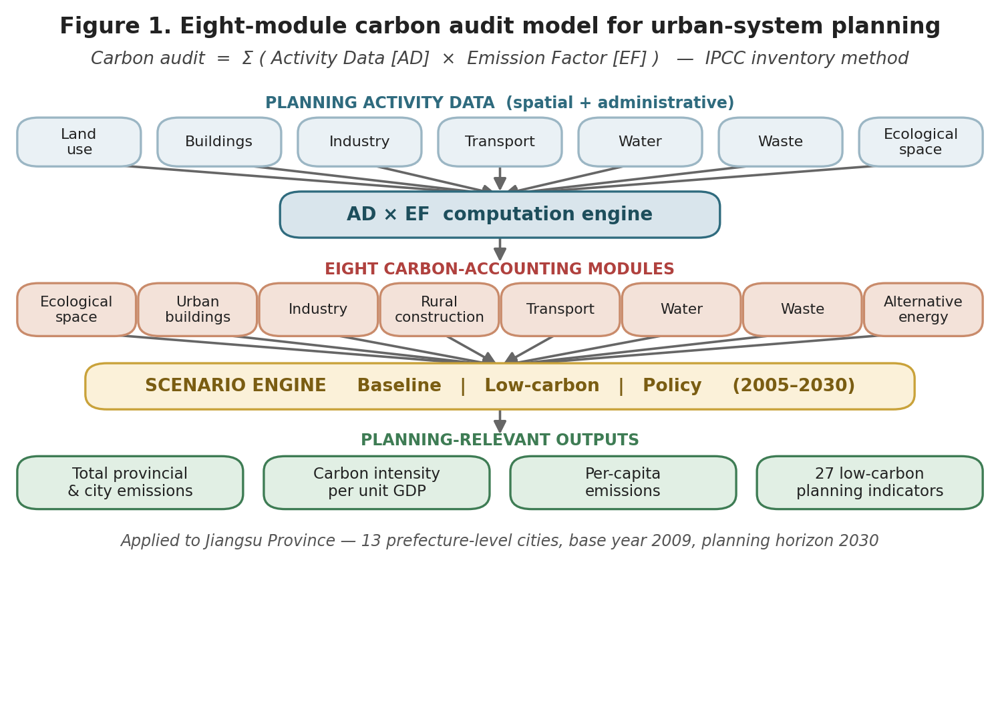
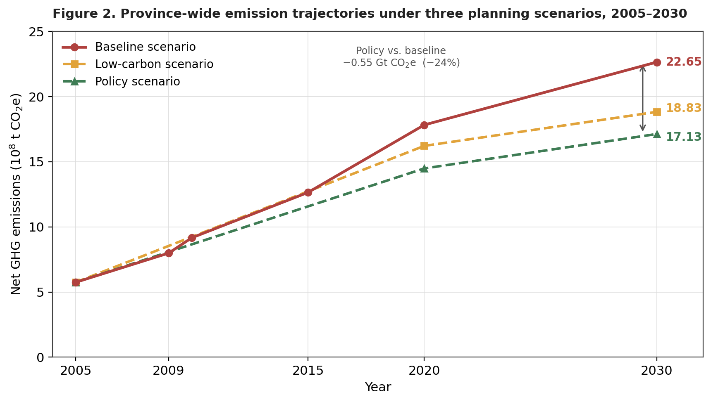
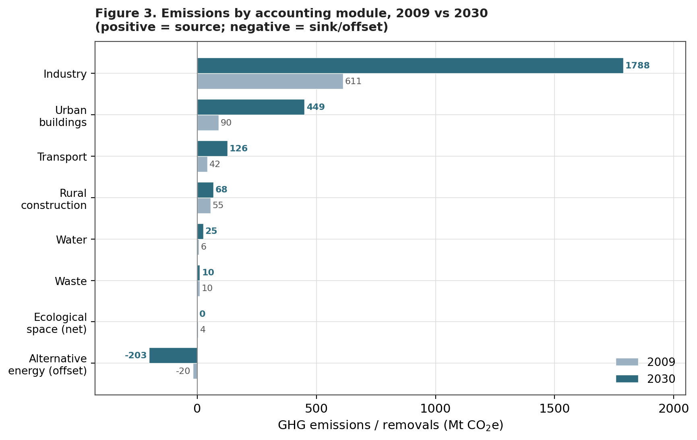
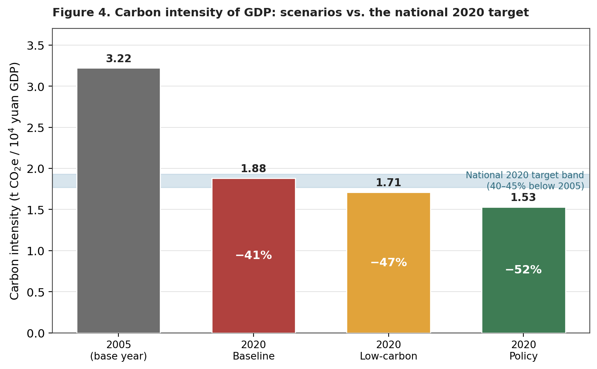
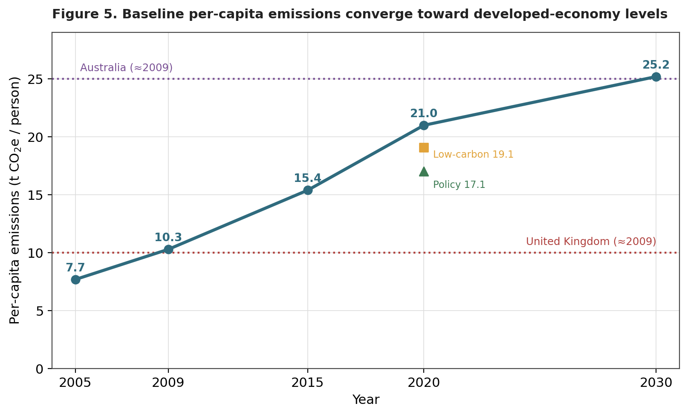

```{=html}
<div class="cp-header">
  <div class="cp-tag">Research Brief · Low-Carbon Urban-System Planning · Carbon Accounting · Arup · 2011</div>
  <h1 class="cp-title">Auditing Carbon at the Scale of the Urban System</h1>
  <div class="cp-subtitle">A Spatial Planning Emissions Model for Jiangsu Province, 2005–2030</div>
  <div class="cp-meta">
    <span class="cp-author">Shuai Ma</span>
  </div>
</div>
```

**Keywords:** urban-system planning; carbon audit; IPCC activity-data method; scenario analysis; carbon intensity; decoupling; Jiangsu Province

## Abstract

Cities and the regional systems that organize them are now the decisive arena for climate mitigation, yet statutory spatial planning in China has lacked a quantitative tool for testing the carbon consequences of planning choices. This brief reports a carbon audit model built for the revision of the Jiangsu Provincial Urban-System Plan. The model adapts the Intergovernmental Panel on Climate Change (IPCC) activity-data method and reorganizes the greenhouse-gas inventory into eight planning-aligned modules covering ecological space, urban buildings, industry, rural construction, transport, water, waste, and alternative energy. Applied across thirteen prefecture-level cities for a 2005 to 2030 horizon under baseline, low-carbon, and policy scenarios, the model shows that coordinated planning policy can hold 2030 provincial emissions to 1,713 million tonnes of carbon dioxide equivalent (Mt CO₂e), roughly a quarter below the baseline, while lowering the carbon intensity of output well beyond the national target. The study demonstrates how macro-level decarbonization goals can be operationalized as measurable indicators inside the statutory planning system.

## 1. Context and the Planning Problem

Climate change is reshaping the agenda of regional and urban planning. In China, an estimated 85 percent of carbon dioxide emissions originate in cities and towns, which makes the spatial organization of the urban system a primary lever for mitigation. In the run-up to the 2009 Copenhagen conference, the national government pledged to reduce the carbon intensity of gross domestic product (GDP) by 40 to 45 percent from its 2005 level by 2020. Translating that economy-wide pledge into spatial policy, however, requires an analytical bridge between a single national number and the thousands of land-use, infrastructure, and density decisions made through statutory planning.

Provincial urban-system planning (城镇体系规划) is the instrument through which a government coordinates the scale, spatial structure, functional division, and major infrastructure of the cities under its jurisdiction. It therefore governs many of the structural drivers of regional energy and resource use, yet it has traditionally been expressed in qualitative spatial terms rather than in quantities of energy or carbon. Two obstacles followed from this. First, the discipline lacked a measurement tool aligned with how planners actually reason about territory, so the carbon implications of alternative spatial structures could not be compared. Second, most provinces had no consistent, audited emissions baseline or scenario database against which to test policy. This study was commissioned to close both gaps for Jiangsu, one of China's most populous and economically advanced provinces, with 77.25 million residents and a 2009 GDP of 3.47 trillion yuan distributed across thirteen prefecture-level cities.

## 2. Research Aim and Questions

The study set out to design a carbon audit model that is technically defensible, planner-usable, and embedded in the statutory planning workflow. It pursued three questions. How can a standardized greenhouse-gas inventory be restructured so that its categories correspond to the working modules of spatial planning? How far do alternative planning and policy scenarios change the magnitude, intensity, and spatial distribution of provincial emissions to 2030? And how can the resulting evidence be converted into indicators and actions that planners can write into urban-system, master, and regulatory detailed plans?

## 3. Data and Method

The model rests on the IPCC accounting identity, in which emissions are estimated as the product of an activity-data term (a measure of how much of a carbon-relevant activity takes place) and an emission factor (the quantity of greenhouse gas released per unit of that activity). The novel step is organizational rather than chemical. Rather than reporting in the IPCC's standard energy, industrial-process, agriculture, and waste categories, the inventory is recombined into eight modules that mirror the components of an urban-system plan. Figure 1 summarizes the structure of the model, from spatial and administrative inputs through the eight accounting modules and the scenario engine to planning-relevant outputs.



Activity data were assembled for two reference years, a 2009 current-state condition and a 2030 planning horizon, from provincial and municipal statistical yearbooks, construction reports, the urban-system planning documents, national and provincial policies and standards, and projections supplied by the provincial planning institute. Emission and sink-removal factors were drawn from the IPCC national greenhouse-gas inventory guidelines and supporting literature. Each module carries its own sub-model: the ecological-space module, for example, treats paddy fields as a methane source and forest, orchard, grassland, and urban trees as carbon sinks, while the building module combines floor area, climate-zone energy intensity, and fuel-specific factors. Industry, which dominates the provincial total, is estimated from sector value added, energy intensity per unit of value added, and direct process emissions from steel and cement.

Three scenarios convert the static accounts into a forward-looking comparison. The baseline scenario extends current trends and planned construction without additional mitigation. The low-carbon scenario applies energy-efficiency and energy-structure improvements. The policy scenario adds the full set of spatial and regulatory planning instruments available to the province. Results are reported not only as absolute emissions but through two intensity indicators that planners and decision-makers can benchmark, namely carbon emissions per unit of GDP and carbon emissions per capita. Table 1 reports the eight-module accounts for the two reference years.

**Table 1. Provincial emissions by accounting module, 2009 and 2030 (baseline)**

| Accounting module | 2009 (Mt CO₂e) | 2009 share | 2030 (Mt CO₂e) | 2030 share | Change |
|---|---:|---:|---:|---:|---:|
| Industry | 611.3 | 74.5% | 1,788.2 | 72.4% | +192% |
| Urban buildings | 89.9 | 11.0% | 449.4 | 18.2% | +400% |
| Transport | 42.5 | 5.2% | 126.4 | 5.1% | +198% |
| Rural construction | 55.1 | 6.7% | 68.0 | 2.8% | +23% |
| Water | 6.4 | 0.8% | 24.9 | 1.0% | +288% |
| Waste | 9.8 | 1.2% | 10.5 | 0.4% | +7% |
| Ecological space (net) | 3.8 | 0.5% | 0.5 | 0.02% | −87% |
| Alternative energy (offset) | −19.5 | — | −202.9 | — | +939% |
| **Net total** | **799.3** | **100%** | **2,264.9** | **100%** | **+193%** |

## 4. Findings

### 4.1 Aggregate trajectory and the value of policy

Under the baseline scenario, net provincial emissions rise from 799 Mt CO₂e in 2009 to 2,265 Mt CO₂e in 2030, an increase of 193 percent and a compound annual growth rate of 4.8 percent. The low-carbon scenario reduces the 2030 total to 1,883 Mt CO₂e, and the policy scenario to 1,713 Mt CO₂e. As Figure 2 shows, the three trajectories are indistinguishable early in the period and diverge after 2015, the point at which planning and efficiency measures begin to bite. The policy scenario avoids roughly 0.55 gigatonnes of CO₂e in 2030 relative to the baseline, a reduction of about 24 percent, and under it the 2030 total is only 114 percent above the 2009 level rather than 193 percent. The baseline curve also continues to climb throughout the horizon and slows only after 2020, which the study reads as a warning that an unmanaged path would place sustained pressure on provincial energy supply.



### 4.2 Sectoral structure and the rise of buildings

The audit makes the structure of the problem legible. Industry is overwhelmingly dominant, accounting for 74.5 percent of emissions in 2009 and still 72.4 percent in 2030, which means that no provincial decarbonization strategy can succeed without an industrial component. The most important structural shift, however, is the rise of urban buildings, whose share climbs from 11.0 to 18.2 percent as floor area, appliance ownership, and per-square-metre energy use all increase. Transport holds a steady share near 5 percent but grows almost threefold in absolute terms, driven by private cars. Figure 3 displays the module-by-module comparison, including the expanding role of alternative energy, whose avoided emissions grow from 19.5 to 202.9 Mt CO₂e as nuclear, wind, and distributed renewables move from 3 to 13 percent of energy supply.



### 4.3 Decoupling output from carbon

Because GDP grows faster than emissions, all three scenarios decouple output from carbon. The carbon intensity of provincial GDP falls from 3.22 tonnes CO₂e per ten thousand yuan in 2005 to 1.88 in the 2020 baseline, a 41 percent reduction that only just reaches the lower bound of the national 40 to 45 percent target. The low-carbon and policy scenarios reduce intensity by 47 and 52 percent respectively, comfortably exceeding the pledge, and the policy scenario continues to 1.39 by 2030. Figure 4 places the three scenarios against the national target band and shows clearly that meeting the pledge is feasible under business-as-usual but that surpassing it depends on deliberate planning policy. Table 2 reports the scenario comparison in full.



**Table 2. Scenario comparison at 2020, relative to 2005**

| Condition | Total emissions (Mt CO₂e) | Carbon intensity (t / 10⁴ yuan) | Intensity vs 2005 | Per-capita (t / person) |
|---|---:|---:|---:|---:|
| 2005 base year | 574.6 | 3.22 | — | 7.69 |
| 2020 Baseline | 1,782.6 | 1.88 | −41% | 20.97 |
| 2020 Low-carbon | 1,622.4 | 1.71 | −47% | 19.09 |
| 2020 Policy | 1,449.3 | 1.53 | −52% | 17.05 |

### 4.4 Per-capita convergence as an equity signal

The per-capita indicator tells a more cautionary story. Because population grows only modestly while emissions surge, per-capita emissions rise from 7.7 tonnes CO₂e in 2005 to 25.2 tonnes in the 2030 baseline. As Figure 5 illustrates, Jiangsu's per-capita level in 2009 was comparable to that of the United Kingdom, but on the baseline path it approaches the level of Australia by 2030. This framing reposes the mitigation question as one of development style and consumption, not merely industrial efficiency, and it shows that policy intervention can hold the 2020 per-capita figure to 17.1 rather than 21.0 tonnes.



The audit also operates at the city scale. Suzhou records the largest absolute emissions in both years, while industrial cities such as Zhenjiang, Wuxi, and Changzhou show industrial shares above 80 percent, and the model links four candidate spatial-structure plans to differences in city-level GDP and emissions growth. The four plans share a common skeleton of one coastal development belt, two urbanization axes, and three metropolitan circles centred on Nanjing, Xuzhou, and the Suzhou–Wuxi–Changzhou corridor, but they differ in how far they extend growth axes into the less developed north of the province. Plans that push development northward raise both GDP and emissions growth in cities such as Xuzhou, Yancheng, and Suqian, which makes the carbon cost of regional rebalancing explicit and quantifiable. This spatial resolution lets planners see which development axes and growth poles carry the heaviest carbon consequences and weigh them against equity goals.

## 5. From Audit to Indicators and Action

The audit is a means rather than an end. Its purpose is to support a low-carbon indicator system that can be written into the three tiers of statutory planning, namely the urban-system plan, the master plan, and the regulatory detailed plan. Following the Kaya decomposition, the study treats emissions as the product of development scale, energy efficiency, energy structure, and the emission intensity of each energy source, and on that basis constructs twenty-seven indicators grouped into driver indicators, policy indicators, and effect indicators. Ten of the twenty-seven already exist within current urban-system planning, which eases adoption, while the remainder extend the planning vocabulary toward carbon. Each module is then paired with an action plan keyed to existing provincial policy and the provincial climate-change program, so that an abstract emissions target descends into concrete planning requirements such as land-use composition, building energy codes, public-transport mode share, and renewable-energy deployment.

## 6. Significance

The contribution of this work is methodological and institutional rather than only empirical. By recombining a standard greenhouse-gas inventory into eight modules that match the working categories of spatial planning, the study makes carbon a quantity that planners can audit, forecast, and regulate using the data and instruments they already possess. It demonstrates a reproducible procedure for moving from a single national intensity pledge to a spatially explicit, multi-scenario, indicator-based plan, and it shows with provincial data that the scenario gap between business-as-usual and active policy is large enough to matter for national targets. The framework is transferable to other provinces facing the same governance gap between climate ambition and statutory spatial planning.

## Author's Contribution

As a member of the project team, I contributed to two core components of the study. First, I helped build the multi-sector accounting model that integrates activity data across land use, buildings, industry, transportation, water, waste, and ecological space for the thirteen-city provincial urban system, structuring heterogeneous statistical and spatial inputs into a single consistent framework. Second, I produced the baseline and policy-scenario estimates for 2005 to 2030 using the per-capita and per-GDP intensity indicators reported here, translating spatial and administrative data into planning-relevant quantitative evidence. This work connected the technical accounting layer to the indicator and scenario outputs that planners ultimately use.

## 7. Limitations and Directions

The model inherits the uncertainty of its emission factors and of long-horizon activity-data projections, and its 2009 base year predates more recent shifts in China's energy mix and industrial policy. The strong dependence of the provincial total on a single dominant industrial module also means that results are sensitive to assumptions about industrial restructuring. Future work could update the factors and base year, couple the audit to spatially explicit land-use and transport models for finer resolution, and test the indicator system through implementation in master and regulatory detailed plans, thereby validating whether the audited scenarios translate into measured reductions on the ground.

*Source material: Special Research Report on Carbon Emissions Auditing for the Jiangsu Provincial Urban-System Plan (2011). All figures were reconstructed in English by the author from the report's underlying data; all tables were converted to the values reported in the original study.*
