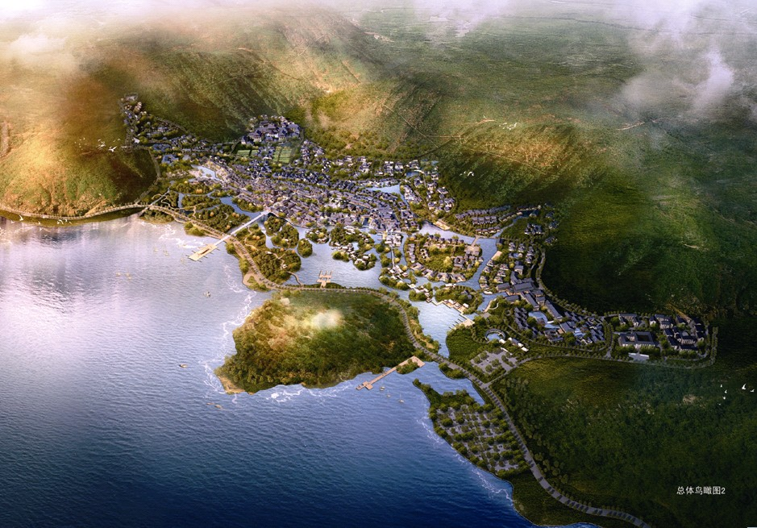

  Shuai Ma &nbsp;·&nbsp; Master Planner, Project Leader &nbsp;·&nbsp; Atkins

{width=100%}

*Figure 1. Project vision illustrating the relationship between the resort, the mountain setting, and Lake Taihu.*

## Project Overview

The Genwan project is a planned cultural tourism and leisure destination in Lingshan, Wuxi, on the northern shore of Lake Taihu. Covering approximately 100 hectares, it was conceived not simply as a collection of hotels and visitor attractions, but as a complete resort district in which landscape, architecture, infrastructure, and operations reinforce a distinctive "Zen realm." The reviewed materials document a multidisciplinary planning process undertaken in 2013, including site reconnaissance, master-plan review, expert workshops, environmental analysis, computer simulation, and comparative infrastructure costing.

The core proposition is that ecological performance should be part of the visitor experience and the Lingshan brand. In this interpretation, Zen is expressed through calm water, shaded paths, changing seasonal vegetation, sheltered courtyards, and a close relationship with the existing mountains and lake. Sustainability therefore serves three connected purposes: creating a comfortable and memorable place, reducing long-term resource demand, and strengthening the commercial identity of the development.

## Spatial Structure and Urban Design

{width=100%}

*Figure 2. Final master plan showing the elongated site between Lake Taihu and the surrounding hills.*

The master plan responds to a narrow, topographically constrained waterfront site. A mixed-use town forms the central spine, while lower-density resort accommodation extends into quieter hillside and lakeside areas. Hotels, conference uses, cultural facilities, commercial streets, residential-style vacation properties, wetlands, canals, and public open spaces are organized as a connected sequence rather than isolated enclaves. The artificial lake and internal waterways act as both placemaking elements and environmental infrastructure, while the shoreline landscape provides a transition to Lake Taihu.

This structure creates a hierarchy of public and private settings: active commercial streets and squares in the center; intimate lanes, courtyards, and garden spaces within accommodation clusters; and larger ecological landscapes along the water and mountain edges. The plan also anticipates different visitor rhythms, from daily tourism and retail activity to conferences, hotel stays, religious learning, and longer leisure visits. Its success depends on maintaining walkable connections and a coherent landscape network as individual development parcels are designed and delivered.

## Climate-Responsive Landscape and Architecture

Microclimate analysis identified summer heat, weak air movement in dense building groups, excessive solar exposure, and cold winter winds as major design risks. The response combines landscape and urban form. Summer breezes from the southeast, the lake, and the hills are protected through ventilation corridors and breaks in long building fronts. Courtyard proportions and varied roof heights encourage local pressure differences and stack ventilation. In winter, trees, bamboo, walls, and building edges filter north-westerly winds at exposed entrances and public spaces.

The landscape concept is a "forest town," with continuous shade along walking and cycling routes, groups of mature trees around gathering places, and larger woodland patches that function as cool islands. Plan-stage targets included 50% tree-canopy coverage across the park, a 20% increase in average summer wind speed, and a 1.5–2°C reduction in average outdoor summer temperature. Buildings were also to use deep eaves, lattice screens, improved insulation and airtightness, natural ventilation, and daylighting. These measures make environmental performance legible in the architectural language rather than hiding it behind equipment.

## Water as Landscape and Infrastructure

Water is the project's organizing ecological system. Instead of relying only on buried pipes, runoff is directed through channels, vegetated swales, rain gardens, wetland areas, and lakeside filter strips before entering the internal lake and canals. The studies proposed roughly 150 metres of swale per hectare in key areas. This network reduces peak runoff, removes sediment and pollutants, supports habitat, and turns drainage into a visible landscape experience.

The internal lake is conceived as a storage and balancing reservoir. Collected rainwater can support landscape irrigation, street cleaning, and water-body replenishment, while controlled overflow connects the system to Lake Taihu. Low-flow fixtures were estimated to reduce building water use by about 32%. Circulation, planted wetlands, variable water depths, and ecological treatment zones were proposed to maintain water quality and avoid stagnant or mosquito-prone conditions. The result is a blue-green system that links flood management, water conservation, biodiversity, and the contemplative character of the resort.

## Energy, Utilities, and Resource Cycles

The energy strategy combines demand reduction with right-sized supply. Passive design, efficient lighting and appliances, high-efficiency cooling equipment, and improved envelopes reduce building loads first. The studies then compare distributed VRV systems, partially centralized systems, and centralized chilled-water and boiler networks for different land uses. Because hotels, retail, conference venues, and accommodation peak at different times, load aggregation can reduce installed capacity. One modeled centralized scenario reduced peak cooling and heating loads by approximately 22.6% and 27.6%, while district-level aggregation reduced peak electrical demand by about 17.4%.

Rather than impose a single system everywhere, the preferred planning logic is adaptable: reserve energy-station sites and utility corridors early, centralize where operating patterns and comfort requirements justify it, and retain distributed systems for remote or independently managed properties. The broader plan-stage ambition was more than 30% combined energy savings relative to a code-compliant baseline.

Waste is treated as another resource cycle. The proposals combine source separation, conventional collection in low-density areas, compact or vacuum-assisted collection in busy commercial streets, composting of food and landscape waste, and recovery of recyclable materials. Targets included a 40% reduction in solid waste requiring off-site disposal and the conversion of part of the food waste stream into landscape fertilizer. This approach reduces service-vehicle conflicts, odour, and visual disturbance in visitor areas.

## Planning Significance

Genwan's strongest idea is integration. Cultural identity, thermal comfort, stormwater, energy, waste, mobility, and landscape are treated as one planning problem. The project shows how a large resort can use environmental systems to create spatial character rather than treating sustainability as a technical add-on. Its implementation would require clear development controls for ventilation corridors, canopy coverage, water-sensitive design, passive building performance, utility reservations, and service logistics, supported by monitoring as the district is phased.

The quantitative values in this brief are design-stage targets and model results from the 2013 project documents, not verified statements of current construction or operating performance. Even so, the materials present a coherent and transferable model: a lake-and-mountain destination where infrastructure is designed as landscape, comfort is achieved through both passive and active systems, and ecological quality becomes part of the visitor experience and long-term development value.
