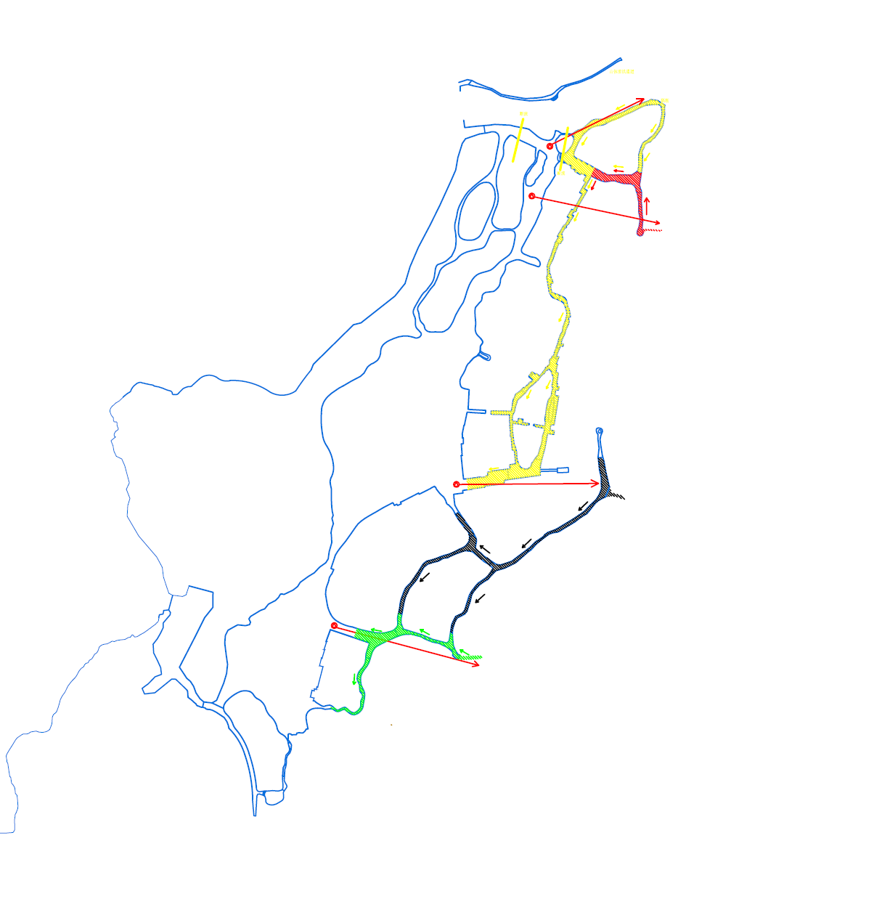
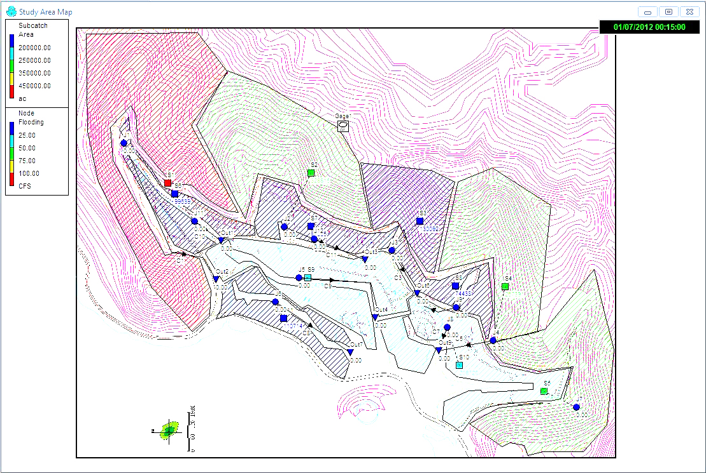
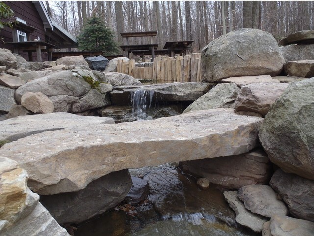
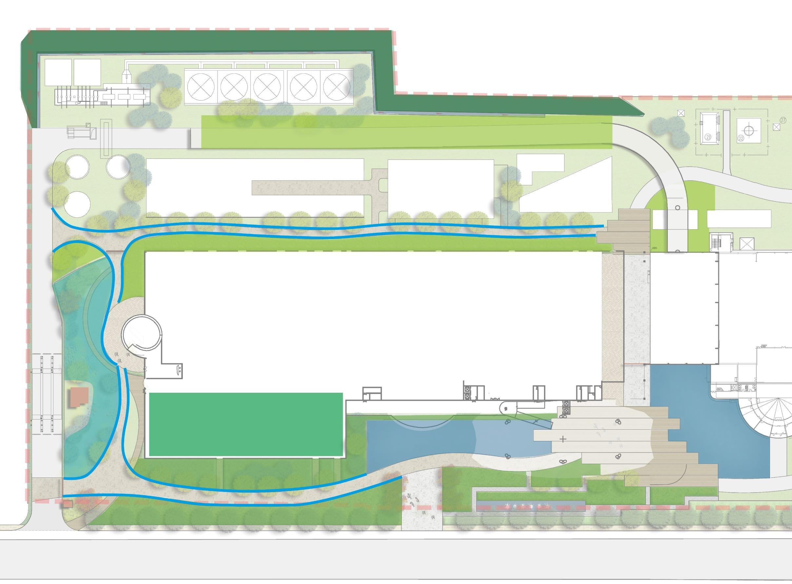
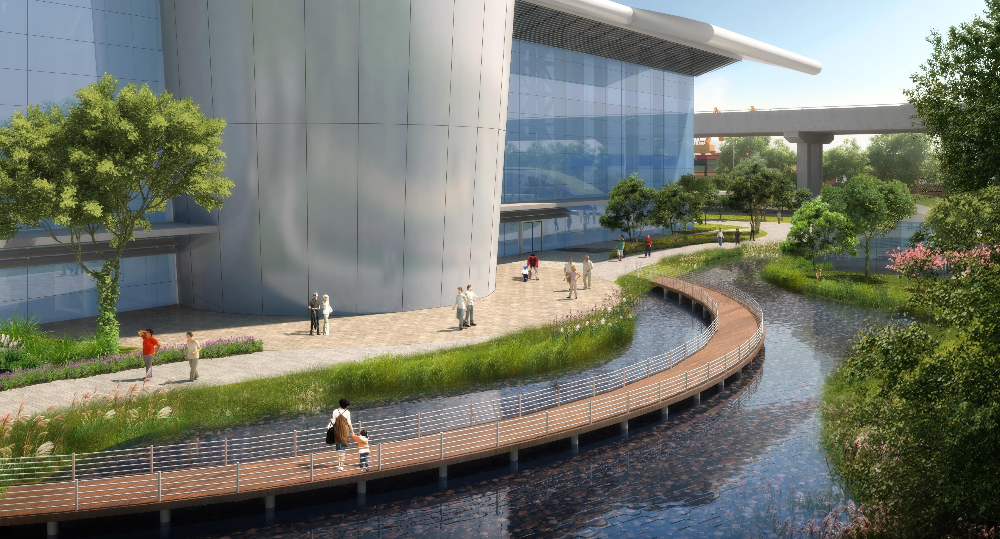
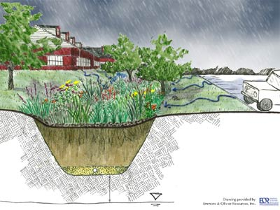

# Living Safely with Water: Sponge-City Design for the Urban Waterfront
## A cross-case framework matching LID configurations to waterfront site types

**Shuai Ma**  
**Role:** Research Leader  
**Type:** Internal Research Report
**Date:** 2017

## Abstract

Waterfront development reshapes the very water system that makes a site attractive: it raises runoff and peak flow, interrupts drainage, and pushes polluted water into rivers and lakes faster. Sponge-city (low-impact development) practice is typically applied as a uniform checklist; this brief argues instead that the workable configuration is conditioned by site type. Drawing on six water-environment and sponge-city projects I worked on between 2011 and 2017, spanning watershed planning to a single CBD plot, it treats them as comparative cases read along three axes: site typology, where the treatment train places its emphasis (source control → conveyance and treatment → storage and reuse → controlled overflow), and measured performance. The methods range from SWMM hydraulic simulation to rational-method calculation, multi-criteria storage trade-offs, and watershed strategy. Five propositions emerge from the comparison: terrain governs source-zone design; low permeability and high groundwater rule out infiltration; density makes storage a residual and cost the binding constraint, so the largest harvesting system is rarely optimal; industrial sites need clean/dirty source separation before treatment; and at basin scale, plot-level LID must be paired with hydromorphological restoration. One rule holds throughout: an amenity water body reduces risk only when its storage, freeboard, water quality, and connectivity are quantified. Because the models were design tools rather than monitored systems, what I offer is a site-conditioned design framework, not claims about verified in-service performance.

**Research question.** Under what site conditions, and through which configurations, can sponge-city (low-impact development) systems reduce a waterfront's flood, drainage, and pollution risk *and* create ecological value at the same time?

Sponge-city practice is often applied as a uniform checklist of measures. Drawing on six water-environment and sponge-city projects I worked on between 2011 and 2017 - spanning watershed planning down to a single CBD plot - I treat the projects as comparative cases and ask what *changes* from site to site: which part of the treatment train should lead, and which performance objective binds, under each type of waterfront. The result is a set of *conditional* design propositions rather than a generic best-practice list.

Three sub-questions organize the comparison:

- *Diagnostic* - how does waterfront urbanization change runoff volume, peak flow, and pollutant load across site types? (Kunshan, Houhai)
- *Evaluative* - how well does a sponge treatment train reduce those risks under design storms, and where does residual risk remain? (Gengwan)
- *Comparative* - how do site conditions decide the trade-off between flood control, water quality, reuse, ecology, and cost? (Suhewan, Mawan, Jinjiang)

## Analytical framework

I read each project along three axes:

1. **Site typology** - scale, terrain, soil and groundwater, land use, dominant pollution source, and sensitivity of the receiving water.
2. **Configuration** - where a project places the emphasis of the treatment train: *source control → conveyance and treatment → storage and reuse → controlled overflow*.
3. **Performance** - runoff-volume and peak control, water quality, residual flooding, reuse yield, ecological value, and cost.

The method is the same loop in every case - diagnose the hazard, set measurable targets, build a treatment train, then test residual risk and refine - but the projects differ in how far they could run that loop, from a full hydraulic model to a single-plot volume calculation.

The measures were compared on standard performance terms:

| Sponge measure | Runoff-volume control | Peak-flow control | Reported SS removal |
| --- | --- | --- | --- |
| Permeable paving | Medium–strong | Medium | 80–90% |
| Green roof | Strong | Medium | 70–80% |
| Rainwater wetland | Strong | Strong | 50–80% |
| Vegetated swale | Strong | Strong | 35–90% |

## Methodology and cases

This is a retrospective comparative multi-case study. The six cases were selected to span a *scale ladder* (watershed → district → plot) and contrasting site conditions, so that differences in configuration can be read against differences in site type rather than scale alone. The methods are matched to what each project needed: SWMM hydraulic simulation at Gengwan; rational-method and volume-budget calculation at Kunshan and Houhai; multi-criteria storage trade-off at Suhewan; pollution-risk-based spatial allocation at Mawan; and a staged watershed strategy at Jinjiang.

**On the strength of the evidence.** These were professional design projects. The models were decision tools, generally *not* calibrated against gauged data or validated by post-construction monitoring, and the standards cited were those current at the time. The findings below are therefore design propositions grounded in modeled and calculated evidence, not claims about verified in-service performance. I treat that limit as part of the method: the same framework would be sharpened by monitoring data, which is one of the directions I want to pursue.

## Cross-case comparison

| Project | Scale | Waterfront type & binding constraint | Dominant configuration | Leading objective | Key evidence |
| --- | --- | --- | --- | --- | --- |
| **Jinjiang** | Watershed / river network | Citywide river system; diffuse and point pollution, single water source, over-hardened channels | Staged basin strategy: point-source → non-point → restore self-purification; softened banks, buffers, re-meandering | Receiving-water recovery | Runoff coeff. target 0.85 → 0.55; 30 m riparian buffer; design velocity 0.012–0.046 m/s |
| **Gengwan** | District / new town | Steep mountain catchments draining to engineered amenity lakes; polluted first flush to sensitive water | Source dispersal (gullies, dry creek) → graded swales by road type → lakeside filter trench → lakes as controlled storage; SWMM-tested | Flood and quality, with modeled residual risk | 100 m swale/ha → outlet TSS < 10 mg/L; refined 50-yr storm: 6,551 m³ to lake, +0.12 m, no site flooding |
| **Mawan** | District / industrial | Waste-to-energy plant; vegetated slope and refuse-truck production roads; mixed pollution; limited green area | Clean/dirty source separation; distributed LID and a 2–3-stage rainwater wetland for clean runoff; dirty roads to controlled collection | Pollution control and ecological demonstration | Full reuse target not feasible → sponge used for pollution control and habitat/education |
| **Kunshan** | District → plot / residential | Flat former farmland; low soil permeability, high groundwater | Shift from infiltration to detention: bioretention + underdrain + overflow + permeable surfaces; pond as detention | Restore pre-development water balance | Runoff coeff. 0.25 → 0.553; +2,171.5 m³ and peak 709 → 1,568 L/s (2-yr storm) |
| **Houhai** | District / dense infill | Dense urban infill; clay and loam soils; space-limited; policy-target-driven | Land-cover conversion (permeable paving, green roof, sunken green) + engineered storage to close the gap | Meet annual runoff-control target | 60% (clay) / 70% (loam) control; 40% non-point reduction; 5-yr drainage storm; +340 m³ tank |
| **Suhewan** | Plot / CBD | Ultra-dense CBD; 216 m tower over underground space; reuse economics | Roof-focused harvesting + right-sized storage; oversized max-collection option rejected | Storage economics and water quality | Max-collection 1,077 m³ rejected → 350 m³ (Parcel 46), 370 m³ (Parcel 44) |

## Conditional findings

The configuration that works is conditioned by the site:

1. **Terrain leads at the source.** On steep mountain-to-water sites, the binding risk is upland energy and a polluted first flush reaching sensitive receiving water, so the train must lead with source-zone dispersal and use amenity water bodies as terminal controlled storage - sized by simulation, not by an infiltration assumption. *(Gengwan)*
2. **Soil and groundwater can void infiltration.** On flat, low-permeability, high-groundwater greenfield sites, infiltration cannot be assumed; the train shifts to detention with underdrained bioretention and overflow, and the goal becomes restoring the pre-development volume and peak rather than draining water away faster. *(Kunshan)*
3. **Density makes storage the residual, and cost the constraint.** On dense infill and CBD plots, surface LID is space-limited: land-cover conversion gets partway and engineered storage closes the gap, at which point the binding question is storage cost and water quality. The largest harvesting system is not the optimum - Suhewan's 1,077 m³ maximum was rejected for a 350 m³ design. *(Houhai, Suhewan)*
4. **Pollution sources demand separation before treatment.** On industrial or mixed waterfronts, the decisive move is separating clean from dirty runoff, not applying uniform LID; once the dirty routes are isolated, the landscape train is free to double as habitat and public education. *(Mawan)*
5. **Plot-level LID is necessary but not sufficient at basin scale.** At watershed scale, site measures must be paired with staged pollutant control and hydromorphological change - softened banks, buffers, re-meandering - to restore the receiving water's own self-purification. *(Jinjiang)*

Across all six, one rule holds: an amenity water body lowers risk only when its storage, freeboard, water quality, and drainage connectivity are quantified.

## Case evidence

### Gengwan — mountain-to-lake new district (the fully modeled case)

Local drainage was designed for only a 1–3-year storm while steep catchments, hardscape, and engineered lakes created several failure paths at once. I mapped the gullies, subcatchments, channels, lakes, and outlets, kept the floodway separate from the amenity-water system, and converted the map into a SWMM network to locate where flooding occurred and which links needed enlarging.

*Figure 1. Drainage network, flow directions, lake system, and outlets, extracted from the original project deck.*

*Figure 2. Original SWMM study-area model: terrain, subcatchments, nodes, and outlets.*

Simulation linked quantity and quality. Pollutants concentrated in the first ~20 minutes, larger storms diluted average TSS, and at about 100 m of swale per hectare the modeled outlet TSS fell below 10 mg/L. The landscape lake stayed a controlled store rather than a hazard:

| Storm | Runoff to lake (m³) | Lake-level rise (m) | Modeled TSS (mg/L) |
| ---: | ---: | ---: | ---: |
| 1-yr | 1,969 | 0.026 | 13.00 |
| 3-yr | 2,929 | 0.039 | 10.83 |
| 50-yr | 6,221 | 0.083 | 7.96 |
| 100-yr | 6,922 | 0.092 | 7.62 |

Node-level results still showed one low-lying subcatchment as the dominant ponding hotspot (a second 50-yr run reached ~1,053 m³ there with shorter swales), so the fix was spatial: more swale length and depressed detention at the flagged nodes. In the refined 50-yr scenario ~6,551 m³ entered the lake for a +0.12 m rise with no site flooding - the lake absorbed more water *by design* once the layout was tuned.

*Figure 3. Stepped rock channel: it dissipates energy and turns conveyance into a landscape feature.*

### Mawan — industrial waterfront (source separation)

At the Mawan Energy Ecological Park, a waste-to-energy plant on the Shenzhen waterfront, the catchment mixed the vegetated Xiaonanshan slope, roofs, visitor areas, and refuse-truck production roads. Clean roof and pedestrian runoff entered a distributed LID system and a 2–3-stage rainwater wetland, while the production roads kept inlets on both sides so their dirtier runoff stayed under controlled collection. Limited green area meant the site could not meet Shenzhen's full reuse standard, so the scheme used sponge methods for pollution control and a demonstration landscape rather than maximum harvesting.

*Figure 4. Mawan site plan (original landscape report): blue corridors route runoff through green space and wetland around the buildings.*

*Figure 5. The wetland detains and filters runoff while doubling as habitat and a public route.*

### Kunshan — flat, high-groundwater residential (infiltration cannot be assumed)

On flat former farmland near Shanghai, development raised the runoff coefficient from 0.25 to 0.553; for a 2-year storm (86.8 mm) the calculated runoff rose by 2,171.5 m³ and peak flow from 709 to 1,568 L/s. Because soil permeability was low and groundwater high, a green facility was not automatically infiltrative, so the design combined bioretention, underdrainage, overflow, and permeable surfaces rather than relying on soakage.

*Figure 6. Bioretention section (Kunshan stormwater report): the planted depression stores, filters, and infiltrates beside the developed surface.*

### Houhai and Suhewan — dense infill and CBD plot (storage as residual, economics as constraint)

At Shenzhen Houhai a policy target became a site water budget: 60% annual control on clay (70% on loam), 40% non-point-source reduction, and a 5-year drainage storm. Land-cover conversion supplied part of the control and a ~340 m³ tank closed the remaining gap. At Shanghai Suhewan, a 216 m tower over dense underground space, the question was how large a reuse system to build. Collecting all hardscape and roof runoff implied a 1,077 m³ tank; weighed against demand, water quality, and cost, a roof-focused design of 350 m³ (Parcel 46) and 370 m³ (Parcel 44) was recommended instead.

| Suhewan storage basis | Volume (m³) |
| --- | ---: |
| Sponge runoff-control requirement (Parcel 46) | 343.24 |
| LEED collection of all hardscape + roof runoff | 1,077.30 |
| Three days' demand, incl. toilet flushing | 470.00 |
| Three days' demand, excl. toilet flushing | 340.00 |
| Final roof-focused recommendation (Parcel 46) | 350.00 |
| Final recommendation (Parcel 44) | 370.00 |

### Jinjiang — watershed (plot LID is not enough)

At river-network scale the strategy was staged: near-term point-source treatment, mid-term diffuse-runoff control, and only then restoration of the river's self-purification - straightened reaches re-meandered, banks and beds softened, and a 30 m planted buffer set back above the wet-season line, with channel velocities held to roughly 0.012–0.046 m/s. The parallel land target pulls the citywide runoff coefficient from about 0.85 toward 0.55. Landscape treatment alone cannot repair a river unless the pollutant load and the hydraulics change with it.

## Implications and next steps

Looking back across the six commissions, the clearest finding is that the configuration that reduces risk in one setting can fail in another. Testing these propositions against post-construction monitoring - and building a formal site-condition decision model that maps site attributes to treatment-train emphasis and storage strategy - is the work I want to pursue in doctoral study.
