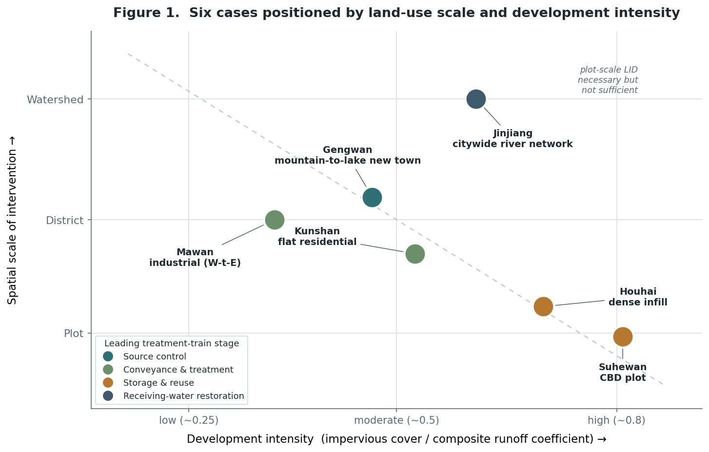
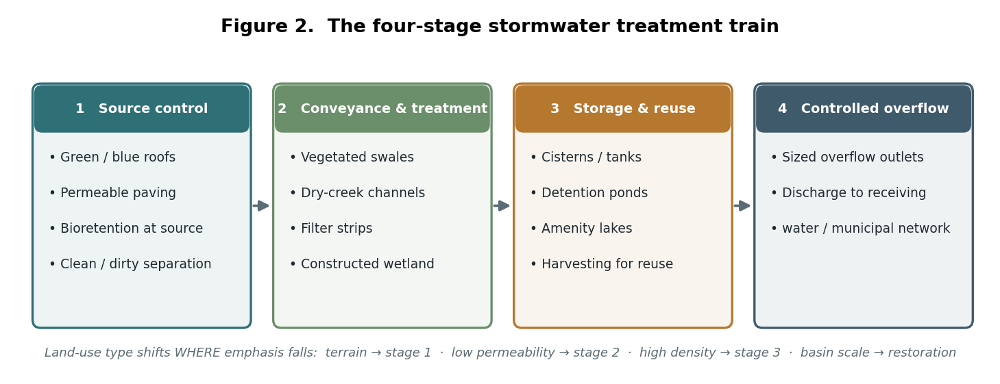
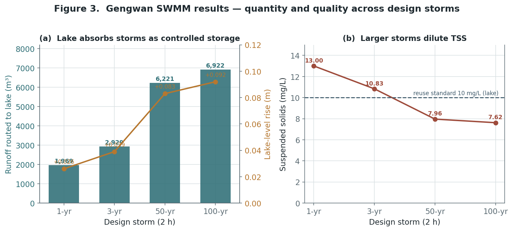
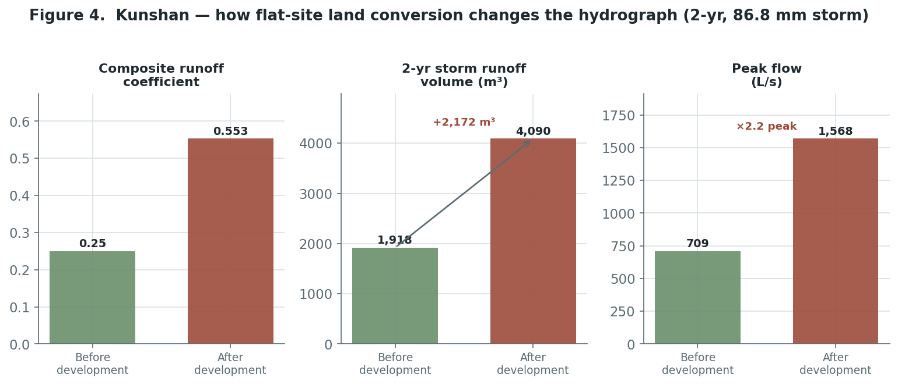
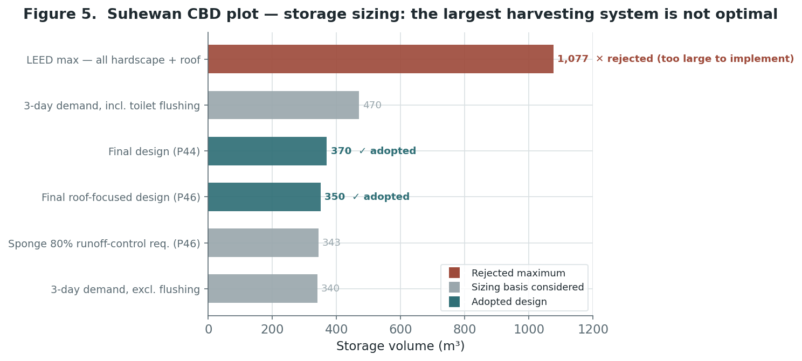

```{=html}
<div class="cp-header">
  <div class="cp-tag">Research Brief · Urban Planning, Water, and Ecological Infrastructure · Retrospective Comparative Case Study · Atkins · 2011–2017</div>
  <h1 class="cp-title">Land Use as a Hydrological Variable</h1>
  <div class="cp-subtitle">A site-conditioned framework for low-impact development across six Chinese urban development types (2011–2017)</div>
  <div class="cp-meta">
    <span class="cp-author">Shuai Ma</span>
  </div>
</div>
```

## Abstract

Sponge-city and low-impact development (LID) practice in China is commonly deployed as a uniform menu of measures applied to a parcel without regard to what the parcel is. This brief advances a different claim: the workable LID configuration is conditioned by land use. Land-use type and intensity, together with the soils, groundwater, dominant pollution source, and receiving-water sensitivity that travel with them, reset the urban water balance, and therefore decide which part of the stormwater treatment train must lead. Drawing on six water-environment and sponge-city projects I contributed to between 2011 and 2017, spanning a citywide river network down to a single central-business-district (CBD) plot, I read the projects as a comparative case series along three axes: land-use typology, treatment-train configuration, and modeled performance. Five conditional propositions emerge, linking terrain to source control, low permeability to detention, density to storage economics, industrial land to clean–dirty separation, and basin scale to hydromorphological restoration. Because the underlying models were design tools rather than monitored systems, the contribution is a land-use-conditioned *design framework* and a future research agenda, not a claim of verified in-service performance.

## 1. Introduction: land use and the urban water balance

Urban planning has long understood land use as, among other things, a hydrological decision. Converting permeable ground to roofs, roads, and hardscape raises the runoff coefficient, increases runoff volume and peak flow, shortens the time to peak, and speeds pollutant delivery to receiving waters — the relationship formalized in the impervious-cover literature and central to the design-with-nature tradition. Stormwater is thus not a downstream engineering residual but a direct expression of land-use type and intensity.

China's Sponge City Program (national guidance in 2014; pilot cities from 2015) institutionalized low-impact development as the preferred response, promoting infiltration, retention, storage, purification, conveyance, and reuse in place of purely "grey" pipe networks. In practice, however, LID is often specified as a standardized checklist, a fixed percentage of permeable paving, green roof, and bioretention, applied identically to a greenfield suburb, a dense infill block, and an industrial yard. This decoupling of technique from land use is the problem this research addresses.

The premise is that the same measure performs differently, and belongs at a different point in the treatment sequence, depending on the land use it serves. A vegetated swale that purifies a low-density street is the wrong lead measure on a refuse-truck production road; an amenity lake that safely stores runoff on a mountain-to-lake new town is a liability on a flat, high-groundwater site. The planning question is therefore not *which measures*, but *which configuration, under which land-use conditions, and to meet which binding objective*.

## 2. Research questions

The brief is organized around one primary question and three sub-questions:

**Primary.** Under what land-use conditions, and through which configurations, can sponge-city / LID systems reduce a site's flood, drainage, and pollution risk *while* creating ecological value?

- *Diagnostic* — how does each land-use type reshape runoff volume, peak flow, and pollutant load? (Kunshan, Houhai)
- *Evaluative* — how well does a treatment train reduce those risks under design storms, and where does residual risk persist? (Gengwan)
- *Comparative* — how do land-use conditions decide the trade-off among flood control, water quality, reuse, ecology, and cost? (Suhewan, Mawan, Jinjiang)

## 3. Conceptual framework

I treat **land use as the independent variable** and read each project along three linked axes. *Typology* captures scale, development intensity (imperviousness / composite runoff coefficient), soils and groundwater, land use and dominant pollution source, and the sensitivity of the receiving water. *Configuration* describes where a project places the emphasis of a four-stage treatment train — source control → conveyance and treatment → storage and reuse → controlled overflow (Figure 2). *Performance* records runoff-volume and peak control, water quality, residual flooding, reuse yield, ecological value, and cost.

Plotting the six cases by scale and intensity (Figure 1) shows the argument visually: as land use moves from low-intensity greenfield toward the dense CBD, and from the plot up to the watershed, the leading stage of the train migrates — from source control, to conveyance, to storage economics, to receiving-water restoration.

{width=88%}
*Figure 1. The six cases positioned by land-use scale and development intensity; marker colour denotes which treatment-train stage leads. The diagonal expresses a recurring finding — plot-scale LID is necessary but not sufficient as scale increases.*

{width=88%}
*Figure 2. The four-stage treatment train used as a common vocabulary across cases. Land use shifts where the emphasis falls rather than which measures exist.*

The measures themselves were compared on standard performance terms drawn from the project evidence and literature. Single LID facilities typically achieve 30–70% peak-flow reduction through infiltration and 50–90% removal of TSS, TN, TP, COD, and BOD through filtration:

| LID measure | Runoff-volume control | Peak-flow control | Pollution control | Reported SS removal | Relative cost | Amenity value |
| --- | --- | --- | --- | --- | --- | --- |
| Permeable paving | Medium–strong | Medium | Medium | 80–90% | Medium | — |
| Green roof | Strong | Medium | Medium | 70–80% | Medium | Good |
| Rainwater wetland | Strong | Strong | Strong | 50–80% | Medium | Good |
| Vegetated swale | Strong | Strong | Weak | 35–90% | Low | Good |

*Table 1. Comparative performance of the four core measures (composite of project reports and cited literature). Note the swale's strong hydraulic but weak stand-alone pollution performance — the reason it leads conveyance but is paired with wetlands or filter strips for quality.*

## 4. Methodology

This is a **retrospective comparative multi-case study**. The six cases were purposively selected to span a *scale ladder* (watershed → district → plot) and contrasting land-use and site conditions, so that differences in configuration can be read against differences in land use rather than scale alone. Case selection prioritized variation on the framework's typology axis: a citywide river network (Jinjiang), a mountain-to-lake new town (Gengwan), an industrial waste-to-energy park (Mawan), a flat greenfield residential district (Kunshan), a dense urban-infill block (Houhai), and an ultra-dense CBD plot (Suhewan).

Methods were matched to what each project required and to the data each generated: SWMM hydraulic-hydrologic simulation at Gengwan; rational-method and volume-budget calculation at Kunshan and Houhai; multi-criteria storage trade-off at Suhewan; pollution-risk-based spatial allocation and a supply–demand water balance at Mawan; and a staged basin strategy with hydromorphological design at Jinjiang. Evidence comprises the original design reports, calculation sheets, a standards-based rainfall series, and the SWMM network. The analytic loop is identical across cases: diagnose the hazard, set measurable targets, assemble a treatment train, then test residual risk and refine, but the cases differ in how far that loop can run.

**On the strength of the evidence.** These were professional design commissions. The models were decision tools, generally *not* calibrated against gauged data or validated by post-construction monitoring, and the standards cited were those current at the time. The findings are therefore design propositions grounded in modeled and calculated evidence, not claims of verified in-service performance. I treat that boundary as part of the method and as a principal motivation for the future work proposed below.

## 5. Cross-case findings

The configuration that reduces risk is conditioned by land use. Five propositions, with one cross-cutting rule, organize the comparison (Table 2):

1. **Terrain leads at the source.** On steep mountain-to-water land, the binding risk is upland energy and a polluted first flush reaching sensitive receiving water; the train must lead with source-zone dispersal and treat amenity water bodies as *terminal, sized* storage — dimensioned by simulation, not by an infiltration assumption. *(Gengwan)*
2. **Soil and groundwater can void infiltration.** On flat, low-permeability, high-groundwater greenfield land, infiltration cannot be assumed; the train shifts to detention with under-drained bioretention and overflow, and the objective becomes restoring the pre-development volume and peak rather than draining water away faster. *(Kunshan)*
3. **Density makes storage a residual, and cost the binding constraint.** On dense infill and CBD plots, surface LID is space-limited: land-cover conversion gets part way and engineered storage closes the gap, at which point the binding question is storage cost and water quality. The largest harvesting system is not the optimum. *(Houhai, Suhewan)*
4. **Industrial land demands separation before treatment.** On mixed industrial waterfronts the decisive move is separating clean from dirty runoff, not applying uniform LID; once dirty routes are isolated, the landscape train is free to double as habitat and public education. *(Mawan)*
5. **Plot-level LID is necessary but not sufficient at basin scale.** At watershed scale, site measures must be paired with staged pollutant control and hydromorphological change — softened banks, riparian buffers, re-meandering — to restore the receiving water's own self-purification. *(Jinjiang)*

Across all six, one rule holds: *an amenity water body lowers risk only when its storage, freeboard, water quality, and drainage connectivity are quantified.*

| Project | Scale | Land-use type & binding constraint | Leading configuration | Key quantified evidence |
| --- | --- | --- | --- | --- |
| **Jinjiang** | Watershed | Citywide river network; single source, over-hardened channels | Staged: point-source → non-point → restore self-purification; softened banks, 30 m buffer | Runoff coeff. target 0.85 → 0.55; design velocity 0.012–0.046 m/s |
| **Gengwan** | District (new town) | Steep catchments draining to amenity lakes; polluted first flush | Source dispersal → graded swales → lakeside filter → lakes as sized storage (SWMM) | ~100 m swale/ha → outlet TSS < 10 mg/L; refined 50-yr: 6,551 m³ to lake, +0.12 m, no flooding |
| **Mawan** | District (industrial) | Waste-to-energy plant; refuse-truck roads; limited green area | Clean/dirty separation; distributed LID + 2–3-stage wetland for clean runoff | Reuse infeasible (217k m³ supply vs 18M m³ demand) → pollution control + demonstration |
| **Kunshan** | District → plot (residential) | Flat former farmland; low permeability, high groundwater | Detention: bioretention + under-drain + overflow + permeable surfaces | Runoff coeff. 0.25 → 0.553; +2,172 m³ and peak 709 → 1,568 L/s (2-yr storm) |
| **Houhai** | District (dense infill) | Clay/loam infill; space-limited; policy-target-driven | Land-cover conversion + engineered storage to close the gap | 60% (clay) / 70% (loam) control; 40% non-point reduction; +340 m³ tank |
| **Suhewan** | Plot (CBD) | 216 m tower over dense underground space; reuse economics | Roof-focused harvesting + right-sized storage | Max-collection 1,077 m³ rejected → 350 m³ (P46), 370 m³ (P44) |

*Table 2. Cross-case synthesis: land use governs the binding constraint and the leading configuration.*

## 6. Case evidence

**Gengwan — the fully modeled case.** Local drainage was designed for only a 1–3-year storm while steep catchments, hardscape, and engineered lakes created several failure paths at once. I separated the floodway from the amenity-water system, mapped subcatchments, channels, lakes, and outlets, and built a SWMM network. Simulation linked quantity and quality: pollutants concentrated in the first ~20 minutes, larger storms diluted average TSS, and at about 100 m of swale per hectare the modeled outlet TSS fell below the 10 mg/L lake reuse standard (Figure 3). The lake remained a controlled store, only a +0.092 m rise even under the 100-year storm, but one low-lying subcatchment persisted as a ponding hotspot. The fix was spatial: more swale length and depressed detention at the flagged nodes. In the refined 50-year run about 6,551 m³ entered the lake for a +0.12 m rise with no site flooding — the lake absorbed more water *by design* once the layout was tuned.

{width=88%}
*Figure 3. Gengwan SWMM results across four design storms: the lake functions as controlled storage (a) while modeled TSS stays at or below the reuse standard (b).*

**Kunshan — infiltration cannot be assumed.** On flat former farmland near Shanghai, development raised the composite runoff coefficient from 0.25 to 0.553; for a 2-year, 86.8 mm storm, the calculated runoff rose by 2,172 m³ and peak flow more than doubled, from 709 to 1,568 L/s (Figure 4). Because soil permeability was low (K ≈ 1.16 × 10⁻⁶ m/s) and groundwater high, a "green" facility was not automatically infiltrative; the design combined bioretention, under-drainage, overflow, and permeable surfaces rather than relying on soakage, with the landscape pond serving as detention.

{width=88%}
*Figure 4. Kunshan — flat-site land conversion sharply increases runoff volume and peak flow, the diagnostic basis for a detention-led rather than infiltration-led train.*

**Suhewan — storage as residual, economics as constraint.** At a 216 m tower over dense underground space in Shanghai, the question was how large a reuse system to build. Collecting all hardscape and roof runoff implied a 1,077 m³ tank (a LEED maximum); weighed against demand, water quality, and cost, and rejected by the owner as impractical, a roof-focused design of 350 m³ (Parcel 46) and 370 m³ (Parcel 44) was adopted instead (Figure 5). The largest system was demonstrably not the optimum.

{width=88%}
*Figure 5. Suhewan storage-sizing alternatives. On dense land, the binding constraint is storage economics, not collection potential.*

**Mawan — separation before treatment.** At a waterfront waste-to-energy park in Shenzhen, the 0.5 km² catchment mixed a vegetated upper slope (runoff coefficient ~0.15) with a built lower zone (~0.65). A supply–demand balance showed full reuse was infeasible, roughly 217,000 m³ of annual harvestable runoff against an 18-million-m³ freshwater cooling demand, so the scheme used sponge methods for pollution control and ecological demonstration rather than maximum harvesting. The decisive move was land-use-based: refuse-truck production roads kept inlets on both sides so their dirty runoff stayed under controlled collection, while clean roof and pedestrian runoff fed distributed LID and a two-to-three-stage rainwater wetland that doubles as habitat and public education (image below).

{width=88%}
*The Mawan rainwater wetland: clean runoff is filtered and detained while the boardwalk turns treatment into a public amenity (project rendering).*

**Jinjiang — plot LID is not enough.** At river-network scale the strategy was staged: near-term point-source treatment, mid-term diffuse-runoff control, and only then restoration of the river's self-purification — straightened reaches re-meandered, banks and beds softened, and a 30 m planted buffer set back above the wet-season line, with channel velocities held to roughly 0.012–0.046 m/s. The parallel land target pulls the citywide runoff coefficient from about 0.85 toward 0.55. Landscape treatment alone cannot repair a river unless the pollutant load and the hydraulics change with it. Conveyance measures such as the stepped dry-creek channel below dissipate energy and turn drainage into landscape, but they operate within this larger basin logic.

{width=82%}
*Stepped rock (dry-creek) channel: a conveyance measure that dissipates energy and aerates flow while reading as landscape (reference image).*

## 7. Discussion, limitations, and a future agenda

Read together, the six commissions support a single planning proposition: **land use is a first-order determinant of stormwater design, and treating LID as land-use-neutral is the recurring error.** A configuration that reduces risk on one land-use type can fail on another, infiltration that works on permeable greenfield is void on Kunshan's clays; an amenity lake that stores runoff safely at Gengwan would be a hazard without quantified freeboard; the maximal harvesting system that satisfies a checklist is wrong on Suhewan's dense plot.

The principal limitation is evidentiary: these were design-stage models and calculations, not monitored systems, and standards were those of their time. That boundary defines the future work I propose: first, to test these propositions against post-construction monitoring; and second, to formalize the framework into a *land-use-conditioned decision model* that maps measurable site attributes (scale, imperviousness, soil permeability, groundwater depth, dominant pollution source, receiving-water sensitivity) to treatment-train emphasis and storage strategy, so sponge-city investment is allocated by land-use evidence rather than uniform percentages. Coupling that model with land-use and zoning instruments, so hydrological performance is set when land use is decided, is the longer-term aim.
