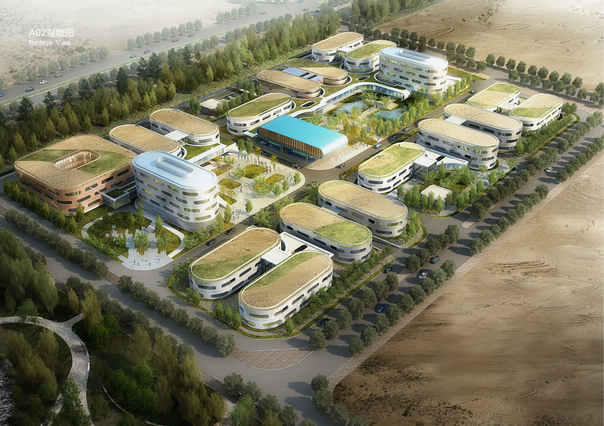
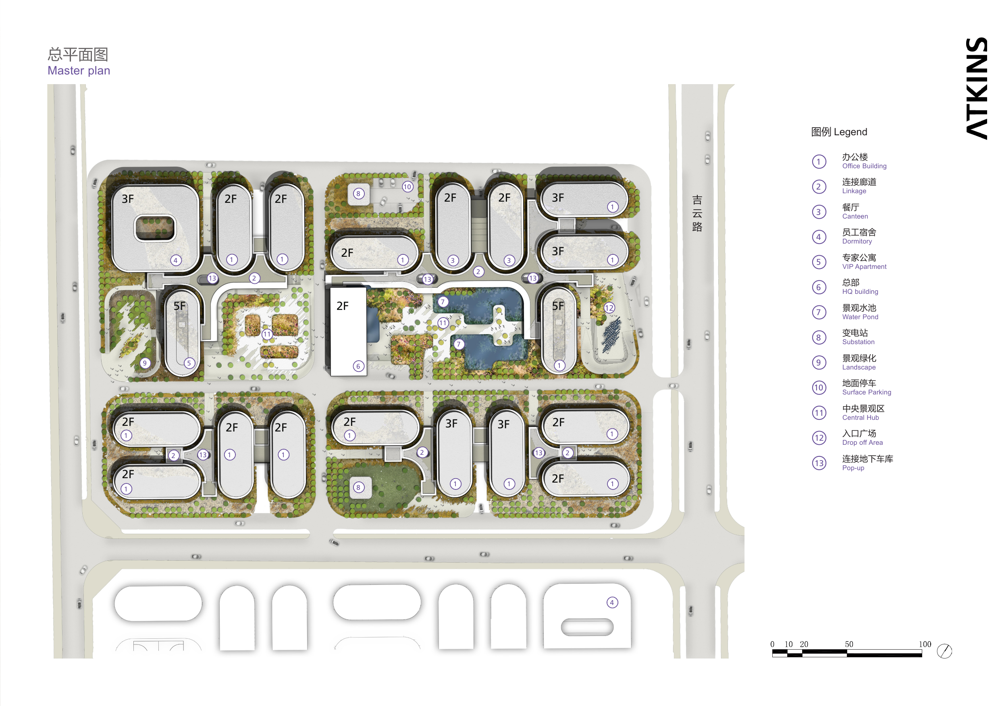
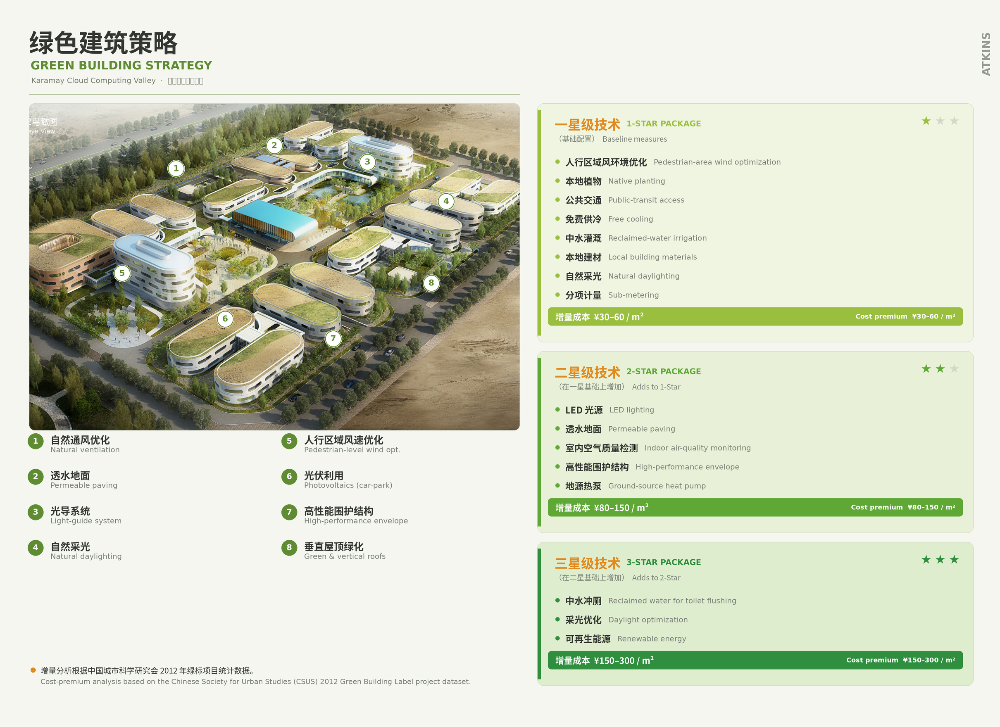
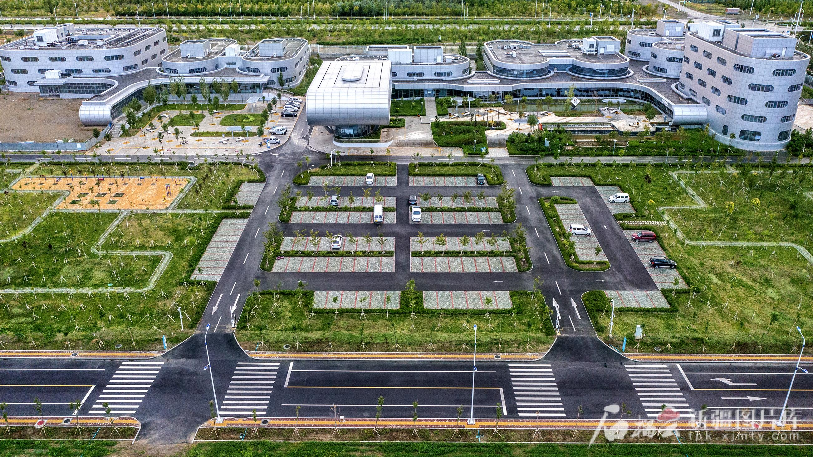
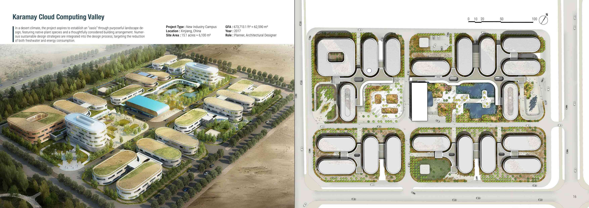
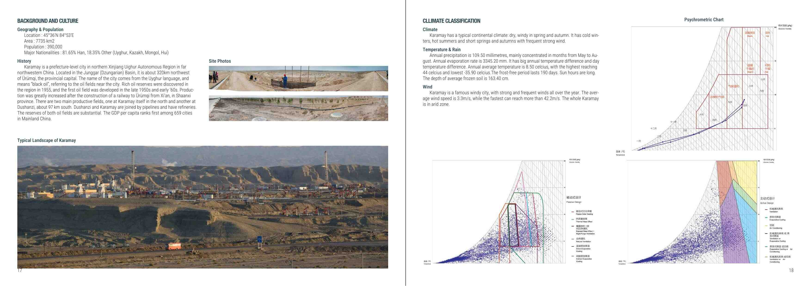
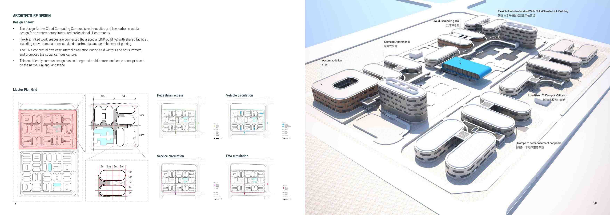
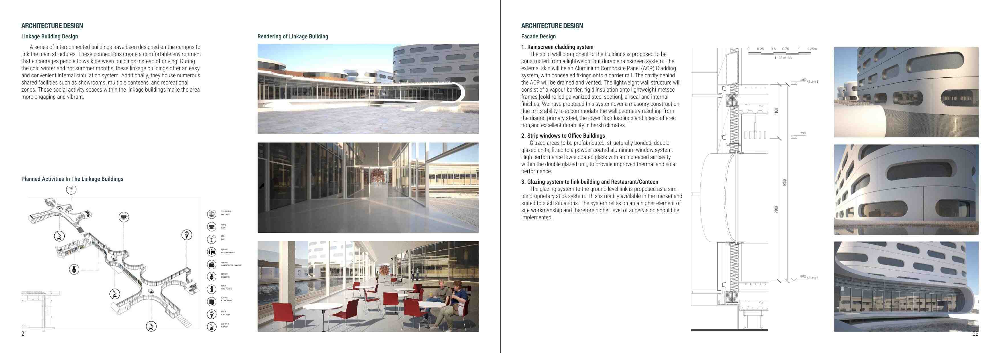
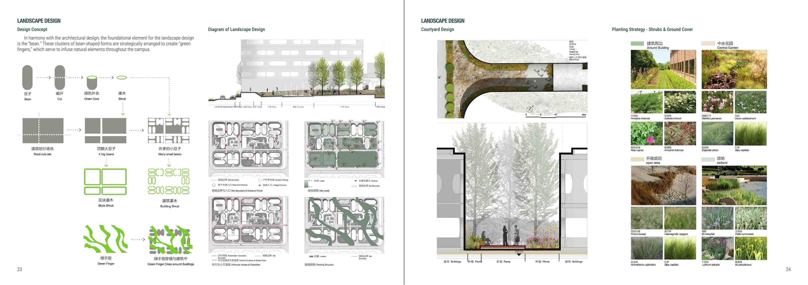
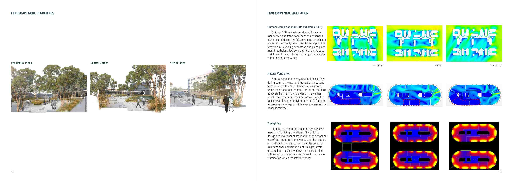

```{=html}
<div class="cp-header">
  <div class="cp-tag">Project Brief · Low-Carbon Campus Planning · Atkins · 2013</div>
  <h1 class="cp-title">Karamay Cloud Computing Valley (KCCV)</h1>
  <div class="cp-subtitle">Low-Carbon Transition for China's First Oil City</div>
  <div class="cp-meta">
    <span class="cp-author">Shuai Ma</span> · Master Planner &amp; Sustainability Expert<br>
    Schematic Design, December 2013 · Complete and in operation · Karamay, Xinjiang, China<br>
    ~5.5 ha campus · 62,950 m² GFA · FAR 0.86 · 40% green coverage
  </div>
</div>
```


*Figure 1. Aerial design rendering — the modular, green-roofed campus organized around a central water court.*

## Project context and site conditions

The Karamay Cloud Computing Valley occupies the northwest corner of the start-up zone of the Karamay Cloud Computing Industrial Park, in the oil city of Karamay on the northern rim of the Junggar (Dzungarian) Basin, roughly 320 kilometers northwest of Ürümqi. Approved by the autonomous-region government in November 2012 as the core base of the national "Tianshan Cloud" initiative, the park has since grown into one of China's principal data-center clusters—home to the country's largest single rendering base and the first dedicated international internet corridor linking northwest China to Beijing, Shanghai, and Guangzhou. The campus was conceived as the park's institutional and social heart: a low-rise, modular community of offices, expert apartments, staff dormitories, a canteen, and a showroom serving a workforce drawn to one of the most remote high-amenity technology destinations in the Chinese interior. Developed across roughly 62,950 square meters of floor area in blocks of two to five storeys—at a deliberately low floor-area ratio of 0.86 with forty percent green coverage—the plan privileges horizontal connection and open space over density, an unusual posture for a high-value technology district.


*Figure 2. Master plan — paired modular blocks stitched together by a continuous LINK building and a central shared spine.*

## Planning and environmental constraints

The defining challenge is climate. Karamay sits in a hyper-arid Gobi environment of extreme continentality: a recorded temperature range from −35.9 °C to 44 °C, annual precipitation of only 109.5 mm against evaporation exceeding 3,300 mm, frozen-soil depths near 1.6 m, and persistent high winds averaging 3.3 m/s with gusts above 42 m/s. Designing a campus capable of attracting and retaining skilled IT professionals in this setting required reconciling thermal comfort, water scarcity, wind exposure, and a compressed construction season—while satisfying national green-building standards and the park's ambition to become a near-zero-carbon district. The brief therefore demanded an integrated response in which urban form, building envelope, and landscape operated as a single climate-adaptive system rather than as separate disciplines.

## Design strategy and project contribution

Three moves distinguish the scheme. First, a continuous **LINK building** threads the otherwise freestanding blocks into one weather-protected network, allowing staff to circulate indoors through bitter winters and searing summers while reinforcing a collegial campus culture. Second, the architecture is **modular and largely prefabricated**, with high-performance façades engineered to exceed the GB 50189 thermal and solar code; off-site fabrication reduced air leakage, stabilized interior temperatures, and shortened on-site work within a short building season. Third, **sustainability is structured as a tiered strategy** mapped to China's one-, two-, and three-star Green Building Label, each tier costed incrementally. Measures span pedestrian-level wind optimization, natural ventilation and daylighting, rooftop photovoltaics, ground-source heat pumps and free cooling, green and vertical roofs, permeable paving, drought-tolerant native planting, and reclaimed-water reuse for irrigation and toilet flushing.


*Figure 3. Green building strategy — climate-responsive measures organized across one-, two-, and three-star performance tiers.*

Binding these moves together, an integrated architecture–landscape concept draws on the native Xinjiang terrain, using sheltered courtyards, green roofs, and massed planting to fashion a cooler, wind-buffered oasis microclimate within the surrounding Gobi. The result is an ensemble rooted in its place—now built, occupied, and operating—that advances the park's stated ambition of becoming a near-zero-carbon district and offers a replicable model for low-carbon development across China's arid west.


*Figure 4. The completed campus in operation, closely realizing the original design intent.*

## Project Portfolio

```{=html}
<div id="kccvCarousel" class="carousel slide" data-bs-ride="carousel">
  <div class="carousel-indicators">
    <button type="button" data-bs-target="#kccvCarousel" data-bs-slide-to="0" class="active" aria-current="true" aria-label="Slide 1"></button>
    <button type="button" data-bs-target="#kccvCarousel" data-bs-slide-to="1" aria-label="Slide 2"></button>
    <button type="button" data-bs-target="#kccvCarousel" data-bs-slide-to="2" aria-label="Slide 3"></button>
    <button type="button" data-bs-target="#kccvCarousel" data-bs-slide-to="3" aria-label="Slide 4"></button>
    <button type="button" data-bs-target="#kccvCarousel" data-bs-slide-to="4" aria-label="Slide 5"></button>
    <button type="button" data-bs-target="#kccvCarousel" data-bs-slide-to="5" aria-label="Slide 6"></button>
  </div>
  <div class="carousel-inner">
    <div class="carousel-item active">
      
    </div>
    <div class="carousel-item">
      
    </div>
    <div class="carousel-item">
      
    </div>
    <div class="carousel-item">
      
    </div>
    <div class="carousel-item">
      
    </div>
    <div class="carousel-item">
      
    </div>
  </div>
  <button class="carousel-control-prev" type="button" data-bs-target="#kccvCarousel" data-bs-slide="prev">
    <span class="carousel-control-prev-icon" aria-hidden="true"></span>
    <span class="visually-hidden">Previous</span>
  </button>
  <button class="carousel-control-next" type="button" data-bs-target="#kccvCarousel" data-bs-slide="next">
    <span class="carousel-control-next-icon" aria-hidden="true"></span>
    <span class="visually-hidden">Next</span>
  </button>
</div>
```
