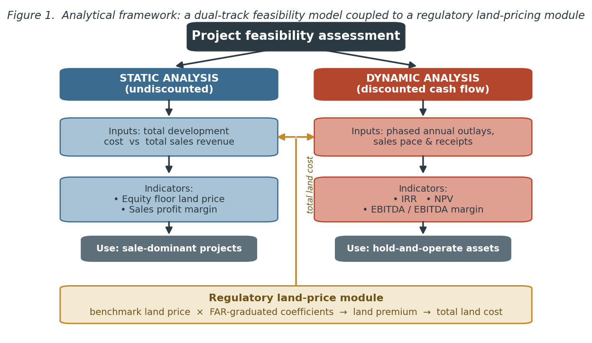
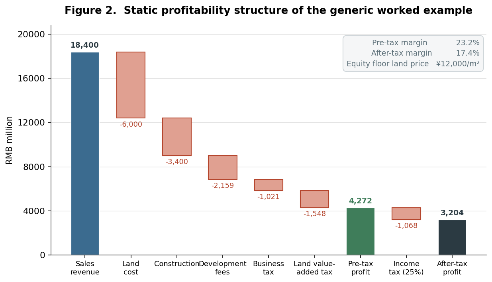
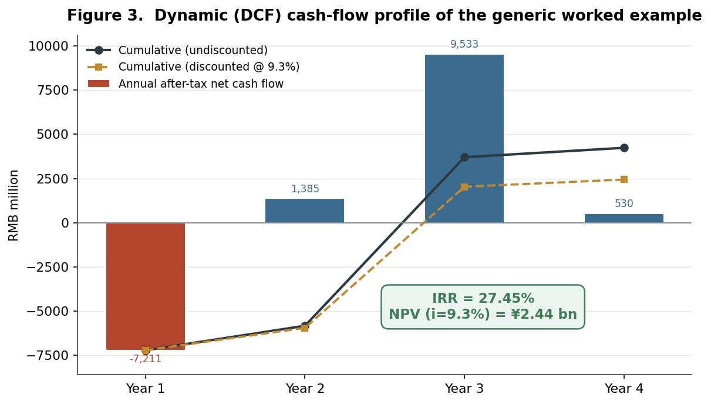
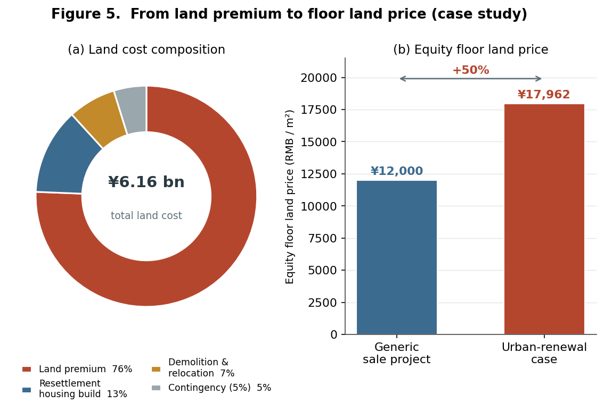

```{=html}
<div class="cp-header">
  <div class="cp-tag">Research Brief · Urban Planning &amp; Real Estate Development · Beamlinked Consulting · 2025</div>
  <h1 class="cp-title">Pro Forma Urbanism</h1>
  <div class="cp-meta">
    <strong>Financial Feasibility Modeling as an Instrument of Land Value Capture in Shenzhen's Market-Led Urban Renewal</strong><br>
    <span class="cp-author">Shuai Ma</span>
  </div>
</div>
```

## Abstract

This brief reconstructs and interrogates an industry-standard real-estate feasibility model, treating it not as a neutral financial calculator but as an instrument of urban governance. Drawing on a forty-five-slide methodological deck authored by a major state-owned developer as its primary source, the study reverse-engineers two coupled apparatuses: a dual-track (static and dynamic) project appraisal that yields residual land value, profit margins, the internal rate of return (IRR) and EBITDA; and a regulatory algorithm that converts floor-area ratio (FAR) and prior land tenure into a payable land premium under Shenzhen's urban renewal (*chengshi gengxin*, 城市更新) regime. A worked comprehensive-redevelopment case demonstrates that roughly 86 percent of the land premium is captured on net-new, market-priced density. The brief argues that the pro forma is the operative interface where planning rules become urban form and where public land value is priced and shared.

**Keywords:** land value capture; urban renewal; feasibility analysis; floor-area ratio; residual land value; Shenzhen; financialization of planning

---

## 1. Research problem

The discounted-cash-flow pro forma is the most consequential document in real-estate development, yet it is among the least examined in planning scholarship. It is the hinge on which land changes use: by solving for the land price that a project can bear after construction, taxes, finance and a target return, the model determines whether a parcel is redeveloped, at what density, and for whom (Graaskamp, 1981; Geltner et al., 2014; Peiser & Hamilton, 2012). In economies where land is privately traded, this residual logic quietly allocates the "betterment" that public planning decisions create. In China, the stakes are sharper still. Urban land is state-owned, and municipal fiscal capacity has long depended on the conveyance of land-use rights—the political economy of "land finance" (*tudi caizheng*, 土地财政) analyzed by Hsing (2010) and, more recently, the land financialization documented by Wu (2022). Here the developer's feasibility model is simultaneously a private investment tool and the mechanism through which the state prices the land value it has helped to manufacture. This brief opens that black box.

## 2. Research question and objectives

The study pursues two questions:

- **RQ1.** How is project-level financial feasibility operationalized in Chinese commercial practice, and which indicators govern the redevelopment go/no-go decision?
- **RQ2.** How does the regulatory land-pricing algorithm embedded in Shenzhen's urban renewal regime function as a land value capture (LVC) instrument, and at which point in the development is value actually captured?

The objectives are correspondingly threefold: to reconstruct the appraisal model as a transparent, reproducible procedure; to quantify its operation through a worked urban-renewal case; and to situate the resulting practice within planning theory on value capture and the financialization of redevelopment.

## 3. Methodology

The brief uses **document analysis coupled with computational reconstruction**. The primary material is an internal methodological presentation that sets out, step by step, a developer's standard approach to project economics and a fully worked land-price calculation for a Shenzhen renewal site. The analytical procedure has four moves. First, qualitative content analysis extracts the indicator set, the cost-and-tax structure, and the embedded decision rules. Second, the static and dynamic pro formas are rebuilt as reproducible spreadsheets and validated against the source's own reported outputs—reproducing, for example, an IRR of 27.45 percent and a net present value (NPV) of approximately ¥2.44 billion at a 9.3 percent discount rate. Third, the regulatory land-pricing case is reconstructed parcel by parcel to trace how statutory coefficients translate planned density into a payable premium. Fourth, the findings are interpreted through the LVC and financialization-of-planning literatures and triangulated against published Shenzhen regulation.

Three caveats frame the analysis. The case figures are illustrative and stylized rather than audited project accounts; the procedure reflects one developer's "house method," not an industry census; and the policy parameters correspond to the 2009–2016 regulatory vintage, since substantially revised. These limits are revisited in Section 7.

## 4. The feasibility apparatus: indicators and pro forma logic

The model's organizing principle is a **dual-track appraisal** (Figure 1). Sale-dominant projects are assessed *statically*: total development cost is set against total sales revenue to derive an equity floor land price and a sales-profit margin. Projects with substantial held, income-producing assets—shopping centers, offices, hotels—require *dynamic* analysis, in which phased annual outlays and receipts are discounted to yield IRR, NPV and EBITDA-based returns. Crucially, both tracks are fed by a regulatory land-price module: the land premium is not an exogenous market price but an administered output of benchmark land values and FAR-graduated coefficients.



The cost-and-tax architecture is standardized (Table 1). Development is financed at the benchmark lending rate; soft costs are pegged as fixed percentages of construction or sales; and three taxes—a sales-based turnover tax, a graduated **land value-added tax (LVAT)**, and corporate income tax—claim a large share of gross revenue. The LVAT, levied at 30–60 percent on the appreciation between sale proceeds and deductible costs, is itself a national value-capture instrument and, after land and construction, the single largest deduction in the worked example.

**Table 1. Standardized pro forma cost-and-tax structure.**

| Block | Line item | Basis / rate |
|---|---|---|
| Land | Land cost (premium, demolition, resettlement build) | Project-specific residual |
| Construction | Self-owned property build cost | Unit cost × gross floor area |
| Fees | Contingency | 5% of build cost |
| | Sales & marketing | 2.8% of gross sales |
| | Management | 2% of (land + build cost) |
| | Finance | 6.55% benchmark lending rate |
| Taxes | Turnover tax & surcharge | 5.55% of sales + resettlement value |
| | Land value-added tax (LVAT) | 30–60% graduated on land appreciation |
| | Corporate income tax | 25% of pre-tax profit |

Applied to a generic 500,000 m² scheme, the static account (Figure 2) converts ¥18.4 billion of sales into ¥4.27 billion of pre-tax and ¥3.20 billion of after-tax profit—margins of 23.2 and 17.4 percent—while implying an equity floor land price of ¥12,000/m². The figure makes visible a finding central to planning: taxes (LVAT plus turnover and income tax) absorb a larger slice of revenue than construction itself. The dynamic account (Figure 3) re-expresses the same project as a four-year cash-flow profile, front-loaded by land payment and back-loaded by sales receipts; discounting yields the headline IRR of 27.45 percent. The two tracks embody distinct planning rationalities—static analysis privileges the residual land bid, dynamic analysis privileges the timing and durability of returns. The distinction matters for urban form: because held commercial and hotel assets are judged not on a single sale but on a long-run operating yield—here a fifteen-year average of EBITA relative to total invested capital—the dynamic track quietly favors programs that internalize income-producing uses, biasing renewal toward mixed-use density rather than pure residential disposal.





## 5. Land value capture through regulated land pricing: the Shenzhen case

The brief's empirical core is Part Three of the source: a land-premium calculation for a comprehensive renewal site assembled from three original parcels—a legacy industrial plot, an old residential district, and an urban village (*chengzhongcun*, 城中村)—each carrying distinct compensation and pricing rules (Table 2). After dedicating roughly one-fifth of the land to the public (the *tudi yijiao lü*, 土地移交率, or land-transfer rate), the developer obtains 72,000 m² of net development land and a planned 540,000 m² program at FAR 7.5.

**Table 2. Case study: original land composition and resettlement obligation.**

| Original land use | Site area (m²) | Existing GFA (m²) | Resettlement ratio | Resettlement GFA (m²) |
|---|---|---|---|---|
| Industrial | 40,000 | 40,000 | 1 : 1.5 | 60,000 |
| Old residential | 30,000 | 40,000 | 1 : 1.3 | 52,000 |
| Urban village | 20,000 | 40,000 | 1 : 1.0 | 40,000 |
| **Total** | **90,000** | **120,000** | — | **152,000** |

The pricing algorithm is deceptively simple—*payable premium = planned GFA × floor land price*—but the floor land price is set by a **FAR-graduated, tenure-contingent schedule**. For the urban-village component, density up to FAR 2.5 is free of premium, density between 2.5 and 4.5 is charged at 20 percent of benchmark, and density above 4.5 is charged at full benchmark. Industrial land upgraded to industrial use enjoys deep concessions, whereas conversion to commercial or residential use is charged at market-assessed values (here four times benchmark) on the floor area added above the original legal building footprint. The schedule is, in effect, a price curve that rises with both density and the "speculative distance" between prior and proposed land use. A further refinement governs where the curve bends. For old-residential and industrial-upgrade pathways the statute prices density in segments around a *land-pricing benchmark FAR* (*dijia jizhun rongjilü*, 地价基准容积率), computed from a planning-standard base FAR adjusted upward as the project dedicates less land to the public. In the case, blending the residential, commercial and research-use components yields a weighted-average benchmark FAR of roughly 4.6 against a planned FAR of 7.5: floor area within the benchmark is charged at standard rates, while the surplus between 4.6 and 7.5—the densest, most profitable tranche—is charged at premium multiples. Density and public capture are thus indexed to one another.

The consequences are striking (Figure 4). Of a total land premium of ¥4.66 billion, the industrial-to-mixed-use pathway alone accounts for about 70 percent, and across all pathways roughly **86 percent of the premium is captured on density above the benchmark entitlement**—the net-new, market-priced floor area the plan creates. Concessionary rates protect original entitlements and productive reuse; full capture falls on the increment.


Translated into the developer's residual, the land premium dominates a total land cost of ¥6.16 billion, alongside demolition, resettlement-housing construction and contingency (Table 3, Figure 5). The resulting equity floor land price of ¥17,962/m² is roughly 50 percent higher than the generic benchmark—a direct measure of the public claim that regulated renewal places on redeveloped land. To this monetary capture the regime adds in-kind extraction: a 15 percent inclusionary affordable-housing set-aside (*peijian baozhangfang*, 配建保障房) and the public land dedication noted above.

**Table 3. Case study: land cost build-up and equity floor land price.**

| Component | RMB million | Share |
|---|---|---|
| Land premium (补缴地价) | 4,660 | 75.6% |
| Resettlement-housing construction | 777 | 12.6% |
| Demolition & relocation | 431 | 7.0% |
| Contingency (5%) | 293 | 4.8% |
| **Total land cost** | **6,161** | **100.0%** |
| **Equity floor land price** | **¥17,962 / m²** | — |



## 6. Discussion

Three planning-theoretic claims follow. First, **FAR operates here as a fiscal instrument, not merely a design control.** Density bonuses are priced rather than granted, and the benchmark-FAR threshold operationalizes the classical "windfalls capture" idea—taxing the betterment that public action creates—with unusual mechanical clarity (Alterman, 2012; Smolka, 2013). Because the public charge concentrates on the increment above prior entitlement, the regime approximates a marginal value-capture curve that most jurisdictions only approach through negotiated exactions.

Second, **the schedule encodes a distributional and land-use logic.** Concessions reward original rights-holders and the retention of productive industrial uses, while market-rate capture targets speculative conversion to commercial and residential floor space. The pricing curve thus steers land use, not only municipal revenue—an under-appreciated form of plan implementation through price.

Third, **the pro forma is where governance becomes built form.** Since the land premium is the residual after target margins and IRR are secured, the statutory rate schedule directly determines how much density and land-use change a site must absorb to "pencil." Planning rules set land price; land price sets feasibility; feasibility sets the program. This circuit also embeds financial rationalities into redevelopment: IRR and EBITDA optics privilege exit velocity and the valuation of held assets, consistent with accounts of the financialization of Chinese urban development (Wu, 2022).

Finally, the model foregrounds the **politics of dispossession and consent** that planning numbers tend to obscure. Demolition, relocation and resettlement obligations are large, negotiated and contentious; the 2009–2016 regime depended on near-unanimous owner agreement, generating holdout risk later restructured by the 2021 *Regulations of Shenzhen Special Economic Zone on Urban Renewal*, which introduced a 95 percent consent threshold plus administrative expropriation. Whether such instruments rebalance or merely accelerate redevelopment remains contested (Shin, 2016; Liu et al., 2017).

## 7. Limitations and conclusion

The analysis rests on a single developer's stylized method and a pre-2021 policy vintage, with illustrative rather than audited figures; its quantitative claims are demonstrative, not generalizable point estimates. Even so, as a transparent reconstruction it establishes the feasibility pro forma as the operative interface of Chinese urban governance—the place where floor-area ratio and land tenure are monetized into urban form. The Shenzhen case shows a value-capture regime that is graduated, tenure-sensitive, and weighted toward the new density that planning itself creates. Two extensions follow naturally: a comparison of this pricing logic against the post-2021 regulatory regime, and a sensitivity analysis of project feasibility to movements in benchmark land prices and FAR coefficients—the policy levers through which planners, perhaps unknowingly, redraw the development map.

---

## References

Alterman, R. (2012). Land-use regulations and property values: The "windfalls capture" idea revisited. In N. Brooks, K. Donaghy, & G.-J. Knaap (Eds.), *The Oxford Handbook of Urban Economics and Planning* (pp. 755–786). Oxford University Press.

Geltner, D., Miller, N. G., Clayton, J., & Eichholtz, P. (2014). *Commercial Real Estate Analysis and Investments* (3rd ed.). OnCourse Learning.

Graaskamp, J. A. (1981). *Fundamentals of Real Estate Development*. Urban Land Institute.

Hsing, Y.-t. (2010). *The Great Urban Transformation: Politics of Land and Property in China*. Oxford University Press.

Liu, G., Yi, Z., Zhang, X., Shrestha, A., Martek, I., & Wei, L. (2017). An evaluation of urban renewal policies of Shenzhen, China. *Sustainability, 9*(6), 1001.

Peiser, R. B., & Hamilton, D. (2012). *Professional Real Estate Development: The ULI Guide to the Business* (3rd ed.). Urban Land Institute.

*Regulations of Shenzhen Special Economic Zone on Urban Renewal* (深圳经济特区城市更新条例) (2021, effective 1 March 2021). Standing Committee of the Shenzhen Municipal People's Congress.

Shin, H. B. (2016). Economic transition and speculative urbanisation in China: Gentrification versus dispossession. *Urban Studies, 53*(3), 471–489.

Smolka, M. O. (2013). *Implementing Value Capture in Latin America: Policies and Tools for Urban Development*. Lincoln Institute of Land Policy.

*Urban Renewal Measures of Shenzhen Municipality* (深圳市城市更新办法) (2009) and *Implementation Rules* (实施细则) (2012). Shenzhen Municipal Government.

Wu, F. (2022). Land financialisation and the financing of urban development in China. *Land Use Policy, 112*, 105337.
