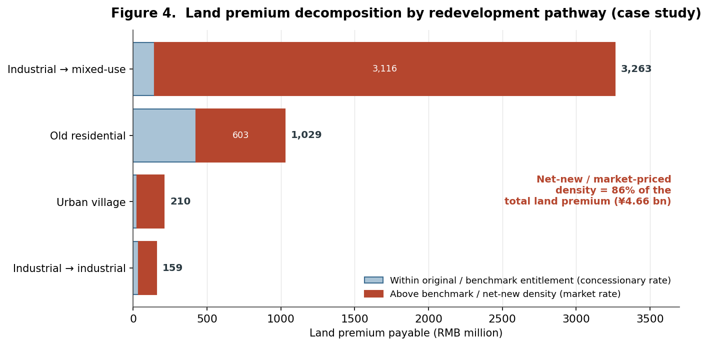

```{=html}
<div class="cp-header">
  <div class="cp-tag">Research Brief · Urban Planning &amp; Real Estate Development · 2025</div>
  <h1 class="cp-title">Pro Forma Urbanism</h1>
  <div class="cp-subtitle">How a Financial Model Prices Public Land in Shenzhen's Urban Renewal</div>
  <div class="cp-meta">
    <span class="cp-author">Shuai Ma</span>
  </div>
</div>
```

## Abstract

In market-led urban renewal, the discounted-cash-flow pro forma is not a neutral calculator but an instrument of governance. This study reconstructs the appraisal-and-pricing apparatus behind Shenzhen's renewal regime and finds that roughly 86 percent of the public land premium is captured on net-new, market-priced density, the additional floor area that redevelopment creates rather than the entitlements owners already held. The pro forma, in other words, is where planning rules become urban form and where public land value is priced and shared.

## What the study does

The analysis reverse-engineers two coupled mechanisms from a set of five internal project-appraisal models used by leading state-owned and private developers. The first is a dual-track feasibility model: sale-dominant projects are assessed statically, comparing total development cost against sales revenue to derive a residual land price and profit margin, while projects with held, income-producing assets are assessed dynamically, discounting phased cash flows to yield the internal rate of return (IRR), net present value, and EBITDA (earnings before interest, taxes, depreciation, and amortization) based returns. The second is a regulatory land-pricing algorithm that converts floor-area ratio (FAR) and prior land tenure into a payable land premium under Shenzhen's urban renewal (*chengshi gengxin*, 城市更新) regime.

Both were rebuilt as reproducible spreadsheets and validated against the sources' own reported outputs, reproducing an IRR of 27.45 percent for the generic worked example. A comprehensive redevelopment case, a site assembled from a legacy industrial plot, an old residential district, and an urban village, was then reconstructed parcel by parcel to trace how statutory coefficients translate planned density into a payable premium.

## What it finds

The land premium is set by a FAR-graduated, tenure-contingent schedule. Density within prior entitlements is free of premium or charged at deep concessions; density above a benchmark threshold is charged at full or near-market value. The schedule is, in effect, a price curve that rises with both density and the "speculative distance" between prior and proposed land use.

The consequence is a value-capture regime that concentrates almost entirely on the increment. Of a ¥4.66 billion land premium in the case, roughly 86 percent falls on density above the benchmark entitlement. Concessionary rates protect original rights-holders and productive industrial reuse; full capture lands on the new, market-priced floor area the plan itself creates.



## Why it matters

FAR here operates as a fiscal instrument, not merely a design control. Density bonuses are priced rather than granted, and by concentrating the public charge on the increment above prior entitlement, the regime approximates the classical value-capture ideal of taxing the betterment that public action creates, with unusual mechanical precision. The schedule also steers land use, not only revenue: it rewards retained industrial uses and penalizes speculative conversion to commercial and residential floor space. And because the land premium is the residual left after target margins and returns are secured, the statutory rate schedule directly determines how much density a site must absorb to "pencil." Planning rules set land price; land price sets feasibility; feasibility sets the program.

---

*This is a condensed brief. The full paper develops the reconstruction, the complete pricing case, and the connection to value-capture and financialization scholarship in detail.*
