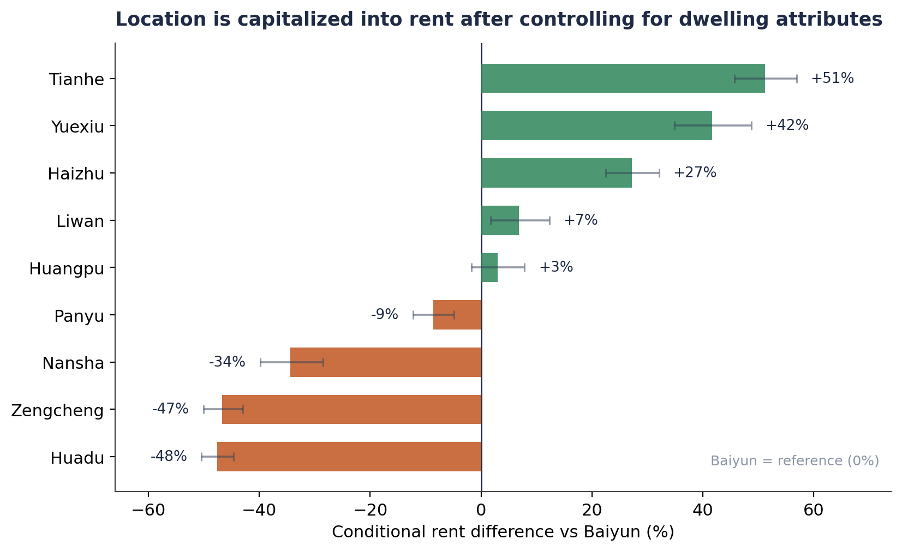

```{=html}
<div class="cp-header">
  <div class="cp-tag">Research Brief · Urban Planning &amp; Real Estate Economics · 2021</div>
  <h1 class="cp-title">Rent as a Map of the City</h1>
  <div class="cp-subtitle">Space, Centrality, and Guangzhou's Rental Market</div>
  <div class="cp-meta">
    <span class="cp-author">Shuai Ma</span>
  </div>
</div>
```

## Abstract

An asking-rent listing is not just a price. Read across space, it is a map of urban structure. This study analyzes 3,000 Guangzhou rental listings and finds that, after controlling for dwelling characteristics, location still commands large premiums: comparable units rent for roughly 51 percent more in central Tianhe than in the Baiyun reference district, while peripheral districts trade at discounts approaching 50 percent. The rental surface, in other words, is where accessibility and centrality are quietly converted into housing cost.

## What the study does

The analysis draws on 3,000 publicly available online listings, collected and cleaned by the author, relating monthly rent to floor area, room configuration, floor level, rental form, and administrative district. Because rents are strongly right-skewed and a levels model is heteroskedastic, the preferred specification models log rent with heteroskedasticity-robust standard errors and district fixed effects, explaining about 78 percent of rent variation. The hedonic framework (Lancaster, 1966; Rosen, 1974) separates two forces that a raw district average silently blends: differences in the dwellings themselves and differences in pure location.

## What it finds

Two patterns organize the results. First, usable space, not partition, is the dominant rent-bearing attribute. A 10 percent increase in floor area is associated with about a 7 percent higher rent, while an additional bedroom at a fixed area carries a small discount, evidence that renters value spaciousness rather than the number of rooms a floor plan advertises.

Second, location remains strongly capitalized after dwelling attributes are controlled, producing a steep center-oriented gradient. Relative to Baiyun, otherwise comparable listings rent for approximately 51 percent more in Tianhe, 42 percent more in Yuexiu, and 27 percent more in Haizhu, the districts that concentrate employment, mature services, and dense transit, while Nansha, Zengcheng, and Huadu fall away by a third to a half.



Controlling for dwelling composition changes the picture in revealing ways. Tianhe's raw rent advantage of about 66 percent narrows to a conditional 51 percent, showing that part of its lead reflects larger, better-configured units. Nansha runs the other way: its modest raw discount deepens once composition is removed, meaning favorable dwellings mask how much cheaper its location truly is. The regression thus exposes a location surface that raw prices understate at the fringe and overstate at the core.

## Why it matters

Read as urban analysis rather than as a pricing exercise, the rental market becomes a diagnostic of where opportunity is concentrated and what it costs to reach it. The gradient reveals a familiar planning tension: the districts offering the best access to jobs and services are the least affordable, because that access is capitalized into rent. Because value attaches to usable area rather than room count, affordability at a fixed budget is often achieved by consuming less space, so headline rents can fall even as crowding rises. And because a district is far too coarse to represent a single housing submarket, the true accessibility gradient is almost certainly steeper than these estimates show, pointing toward finer geography as the next analytical gain. The estimates are associational rather than causal, since the listings omit exact location, accessibility, and building quality.

## Methods and tools

The study was built in R. It uses ordinary least squares hedonic regression on a log-transformed dependent variable, with HC1 heteroskedasticity-robust standard errors, district fixed effects, and joint (F) tests of significance. Supporting work included the collection and cleaning of unstructured publicly available data, multicollinearity diagnostics, and principal-component and K-means analyses; the figures were reproduced in English from the model outputs.

*This is a condensed brief. The full paper develops the specification, the complete district and attribute results, and the planning interpretation in detail.*
