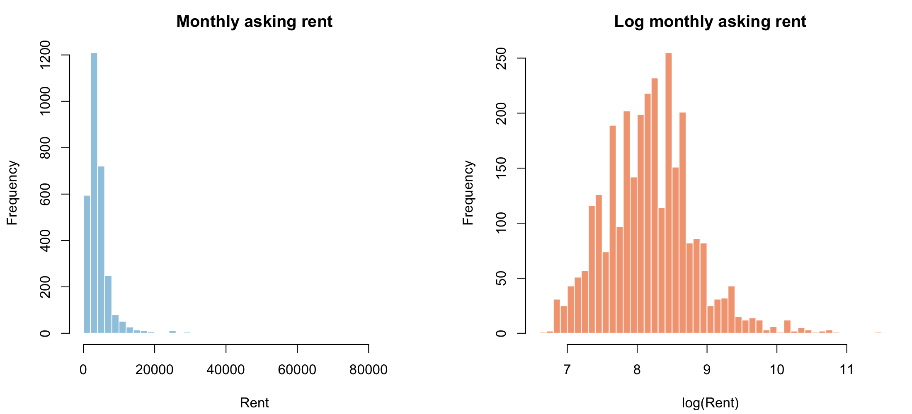
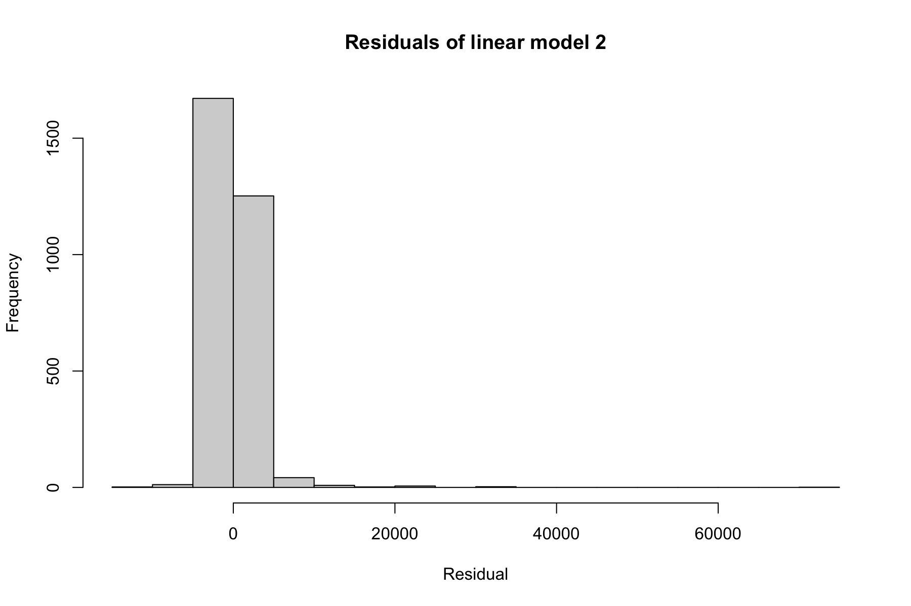
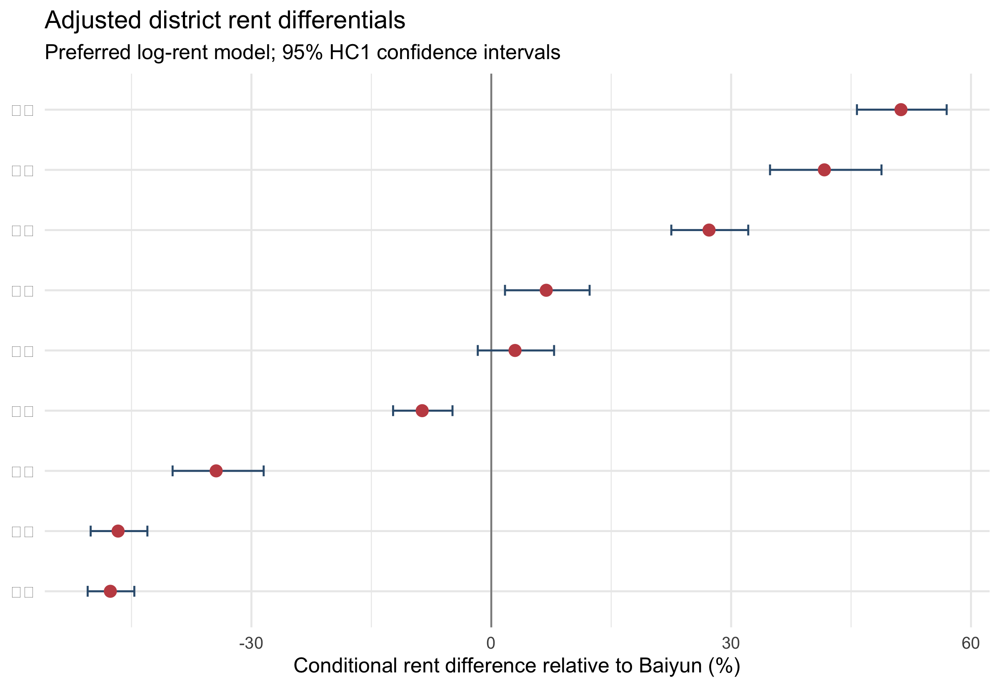
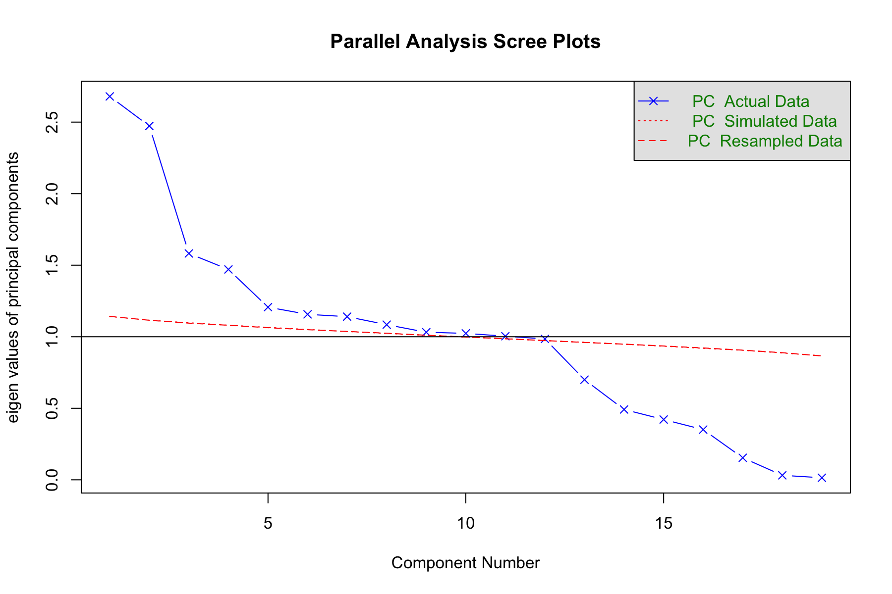
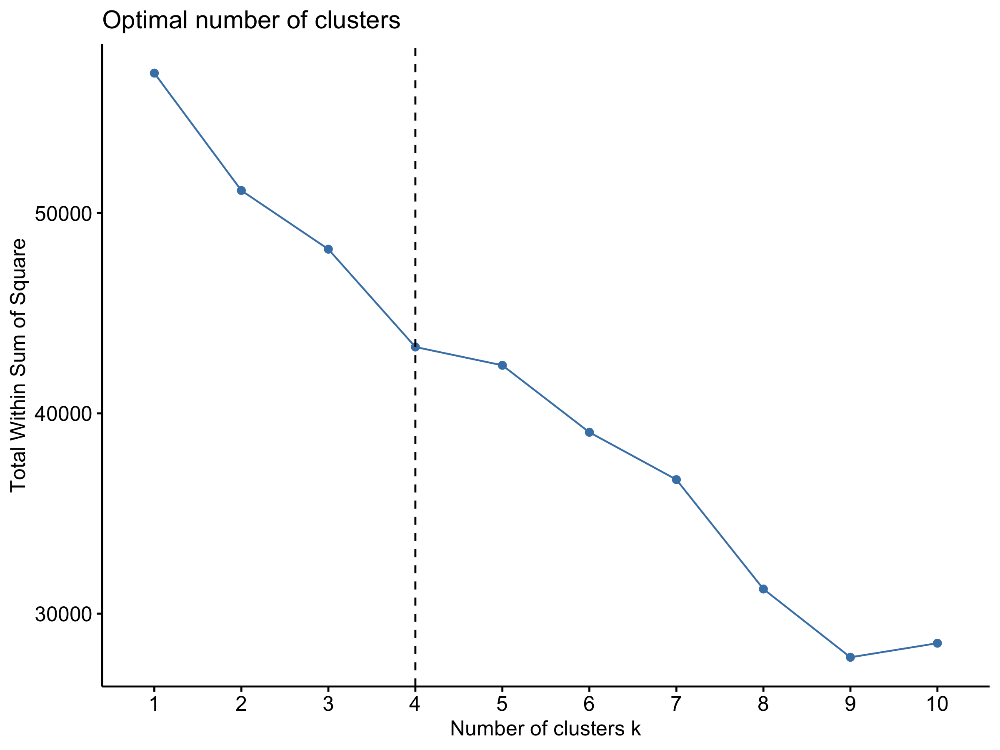
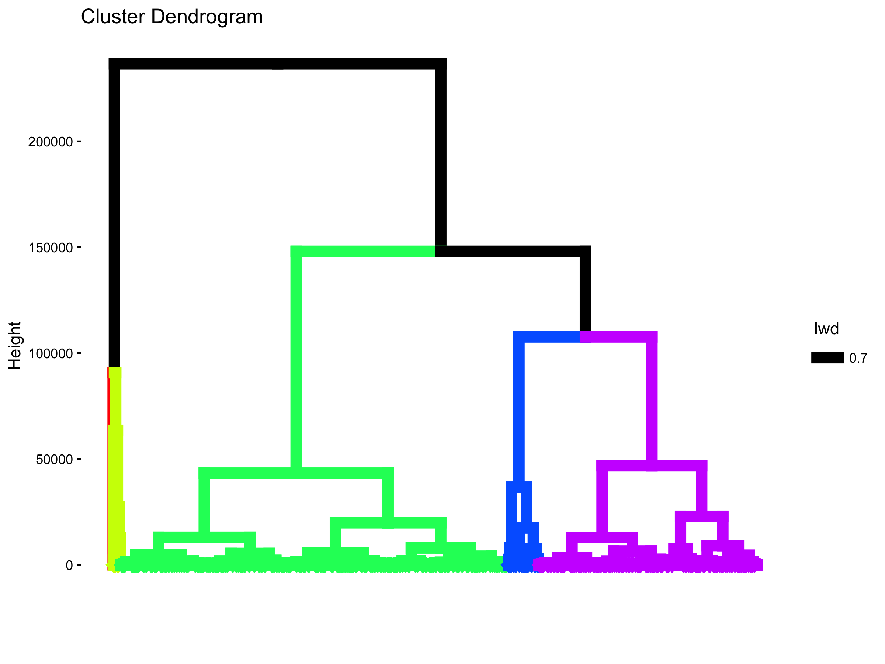

```{r}
#| label: setup
#| include: false

tables_dir <- file.path("..", "outputs", "tables")

district_names <- c(
  "天河" = "Tianhe",
  "白云" = "Baiyun",
  "海珠" = "Haizhu",
  "番禺" = "Panyu",
  "荔湾" = "Liwan",
  "越秀" = "Yuexiu",
  "黄埔" = "Huangpu",
  "增城" = "Zengcheng",
  "南沙" = "Nansha",
  "花都" = "Huadu",
  "从化" = "Conghua"
)

format_p <- function(value) {
  ifelse(value < 0.001, "<0.001", sprintf("%.3f", value))
}
```

## Abstract

This report studies the correlates of monthly asking rents in Guangzhou using 3,000 publicly available online rental listings collected and cleaned by the author for a September 2021 project. A hedonic regression framework relates rent to floor area, dwelling configuration, floor level, rental form, and district. The benchmark levels model explains approximately 59% of the cross-sectional variation in asking rents. Because rents are strongly right-skewed and the levels model is heteroskedastic, the preferred specification models log rent and reports heteroskedasticity-robust standard errors. Its results indicate that floor area is the dominant structural correlate: a 10% increase in area is associated with approximately 7.15% higher rent, holding observed attributes constant. Bathrooms and the building floor are also positively associated with rent, while an additional bedroom at a fixed floor area is associated with a small discount, consistent with more intensive subdivision of the same space. Location remains important after controlling for dwelling characteristics. Relative to Baiyun, the preferred model estimates conditional rent premiums of approximately 51% in Tianhe, 42% in Yuexiu, and 27% in Haizhu. These estimates describe market capitalization patterns; they should not be read as causal effects because the listings omit exact location, accessibility, building age, furnishing, and other quality dimensions.

## 1. Research question and analytical perspective

Housing is a bundle of attributes rather than a homogeneous commodity. Tenants jointly purchase interior space, room configuration, building position, neighborhood access, and a location within the metropolitan labor and amenity system. The hedonic framework developed by Lancaster (1966) and Rosen (1974) provides a natural empirical language for this market: observed rent is modeled as the price of a bundle of housing and location characteristics.

The central question is:

> Which observed dwelling and district characteristics are most strongly associated with residential asking rents in Guangzhou?

The word *associated* is important. The data are a cross-section of online listings, not a randomized intervention or a panel of repeated transactions. The regressions identify conditional price differences within this sample. They do not isolate causal effects of district boundaries, floor area, or housing design.

The original project compared backward, forward, and bidirectional stepwise regression. Those procedures remain useful as sensitivity checks, but entry order is not an economic ranking of importance: it depends on units of measurement, correlations among regressors, and the chosen significance threshold. The main interpretation below therefore comes from a theory-led specification, joint tests, effect sizes, and robust uncertainty estimates.

## 2. Data

### 2.1 Source and scope

The analytical file contains 3,000 publicly accessible Guangzhou rental listings gathered from the internet and subsequently cleaned by the author. The observations represent advertised monthly rents rather than executed lease prices. Each row records the rental form, district, floor area, numbers of bedrooms, living rooms and bathrooms, building floor, a categorical floor-position indicator, a brand indicator, and monthly rent.

The sample is broad but not spatially balanced. Tianhe alone contributes 731 listings, whereas Conghua contributes only one. The Conghua observation is retained in descriptive totals but excluded from the preferred regressions because a district effect cannot be credibly estimated from a singleton. The preferred regression sample therefore contains 2,999 observations.

```{r}
#| label: tbl-descriptive
#| tbl-cap: "Descriptive statistics for the analytical sample"

descriptive <- read.csv(file.path(tables_dir, "sample_descriptive_statistics.csv"))
variable_labels <- c(
  Rent = "Monthly rent",
  Area = "Floor area",
  B = "Bedrooms",
  L = "Living rooms",
  R = "Bathrooms",
  Floor = "Building floor"
)
descriptive$Variable <- unname(variable_labels[descriptive$Variable])
descriptive$Mean <- sprintf("%.2f", descriptive$Mean)
descriptive$SD <- sprintf("%.2f", descriptive$SD)
descriptive$P25 <- sprintf("%.1f", descriptive$P25)
descriptive$Median <- sprintf("%.1f", descriptive$Median)
descriptive$P75 <- sprintf("%.1f", descriptive$P75)
knitr::kable(descriptive, align = c("l", rep("r", 8)))
```

The rent distribution is markedly asymmetric. Median monthly rent is 3,500, mean rent is 4,429, and the maximum reaches 95,000. Floor area is similarly dispersed, ranging from 5 to 620 square meters. The contrast between the mean and median, together with the long upper tail in @fig-rent-distribution, motivates a log-rent specification in addition to the original levels model.

{#fig-rent-distribution width=95%}

```{r}
#| label: tbl-district-sample
#| tbl-cap: "District coverage and unadjusted asking rents"

district_sample <- read.csv(file.path(tables_dir, "district_summary.csv"))
district_sample$District <- unname(district_names[district_sample$District])
district_sample$Mean_rent <- sprintf("%.0f", district_sample$Mean_rent)
district_sample$Median_rent <- sprintf("%.0f", district_sample$Median_rent)
names(district_sample) <- c("District", "Listings", "Mean rent", "Median rent")
knitr::kable(district_sample, align = c("l", "r", "r", "r"))
```

These raw district averages mix location with dwelling composition. Tianhe's mean rent, for example, may be higher because its listings are larger or differ in rental form. Regression is used to separate those observed compositional differences from the remaining district differential.

### 2.2 Measurement limitations

Five limitations shape the interpretation of every estimate:

1. **Asking price is not transaction price.** Negotiation and unobserved vacancy duration may separate advertised rent from the final lease.
2. **Online coverage is selective.** Platform listings may overrepresent professionally marketed, newer, or more central properties.
3. **Location is coarse.** District indicators cannot capture metro proximity, employment access, school quality, neighborhood amenities, or within-district submarkets.
4. **Housing quality is incomplete.** Building age, elevator access, furnishing, renovation quality, orientation, and property-management services are unavailable.
5. **Some indicators are nearly redundant.** `Type` and `Brand` have a sample correlation of 0.985, so their separate coefficients in the full model are unstable.

The results are consequently best read as a careful description of this online market sample, not as a complete structural model of Guangzhou's rental market.

## 3. Empirical strategy

### 3.1 Hedonic specification

The benchmark levels model follows the original project:

$$
Rent_i = \alpha + \beta_1 Type_i + \beta_2 Area_i + \beta_3 B_i
+ \beta_4 L_i + \beta_5 R_i + \beta_6 Floor_i
+ \boldsymbol{\delta}'District_i + \boldsymbol{\theta}'HF_i
+ \beta_7 Brand_i + \varepsilon_i .
$$

Here, $B$, $L$, and $R$ denote bedrooms, living rooms, and bathrooms. `Floor` is the numerical building floor, while $HF$ distinguishes low, middle, and high floor categories. District fixed effects absorb average observed and unobserved differences shared by listings in the same district.

The presentation underlying this report described two versions of this benchmark that differ only in how the categorical regressors are coded. Model 1 enters location and floor position as single categorical variables (`District` and `HF`), letting the estimation routine construct the contrasts internally. Model 2 instead enters them as explicit indicator columns: one dummy per district (Baiyun, Tianhe, Haizhu, and so on through Zengcheng) together with separate high-, middle-, and low-floor dummies. Econometrically the two are the same specification once one district indicator and one floor indicator are dropped as reference categories. They yield identical coefficients on the retained terms, fitted values, $R^2$, and residuals, so their agreement is an algebraic identity rather than independent confirmation. The levels-model residual histogram reported below (@fig-levels-residuals, whose panel is titled "linear model 2") is computed from Model 2 and therefore characterizes Model 1 equally well.

### 3.2 Preferred specification

Three decisions define the preferred model:

- Conghua is excluded because it has only one listing.
- Baiyun is set explicitly as the district reference because it has a large sample and provides a useful middle-market comparison.
- `Brand` is omitted because it is almost perfectly correlated with rental form. Retaining both creates severe variance inflation without improving adjusted fit.

The preferred equation uses log rent and log floor area:

$$
\log(Rent_i) = \alpha + \beta_1 Type_i + \beta_2 \log(Area_i)
+ \beta_3 B_i + \beta_4 L_i + \beta_5 R_i + \beta_6 Floor_i
+ \boldsymbol{\delta}'District_i + \boldsymbol{\theta}'HF_i + \varepsilon_i .
$$

The log transformation reduces the leverage of a small number of very expensive listings and permits an elasticity interpretation for floor area. Because a Breusch--Pagan diagnostic still rejects homoskedasticity after transformation, all preferred-model tests and confidence intervals use HC1 heteroskedasticity-robust standard errors.

### 3.3 Model selection and multicollinearity

The original forward-selection path entered area first, followed by district and floor-related information; backward selection treated brand and categorical floor position as comparatively weak. This pattern is informative, but stepwise selection does not establish that the first variable entered has the largest causal or economic effect. It also behaves unpredictably when regressors overlap. In this sample, rental form and brand are nearly duplicates, while floor area is correlated with room counts. The negative bedroom coefficient discussed below is a conditional effect at fixed area, not evidence that larger dwellings rent for less.

Principal-component analysis confirms that structural attributes share common variation, especially area and room configuration. PCA is useful as a diagnostic but is not the main estimator because its synthetic components are harder to translate into planning or market terms.

## 4. Results

### 4.1 Model fit and functional form

```{r}
#| label: tbl-model-fit
#| tbl-cap: "Model fit"

model_fit <- read.csv(file.path(tables_dir, "model_fit_comparison.csv"))
model_fit$R_squared <- sprintf("%.3f", model_fit$R_squared)
model_fit$Adjusted_R_squared <- sprintf("%.3f", model_fit$Adjusted_R_squared)
model_fit$Residual_SE <- sprintf("%.3f", model_fit$Residual_SE)
names(model_fit) <- c("Model", "N", "R-squared", "Adjusted R-squared", "Residual SE")
knitr::kable(model_fit, align = c("l", rep("r", 4)))
```

The benchmark model explains 59.3% of variation in rent, with an adjusted $R^2$ of 0.590. Removing the collinear brand indicator and the Conghua singleton leaves adjusted fit essentially unchanged. This is strong evidence that `Brand` contributes almost no independent explanatory information once rental form and the other attributes are present.

The preferred log model has an $R^2$ of 0.783. Because the dependent-variable scale differs, that value is not directly comparable to the levels-model $R^2$ as a formal model-selection test. It does, however, show that the multiplicative specification tracks proportional rent variation well. The levels-model residual histogram in @fig-levels-residuals displays the influence of expensive upper-tail observations that motivates this transformation.

{#fig-levels-residuals width=78%}

### 4.2 Dwelling attributes

```{r}
#| label: tbl-structural-effects
#| tbl-cap: "Preferred log-rent estimates for dwelling attributes"

coefficients <- read.csv(file.path(tables_dir, "preferred_log_model_coefficients.csv"))
structural_terms <- c("Type", "log(Area)", "B", "L", "R", "Floor", "HF低楼层", "HF高楼层")
structural <- coefficients[match(structural_terms, coefficients$Term), ]
structural_labels <- c(
  "Rental form (Type = 1)",
  "Log floor area",
  "Bedrooms",
  "Living rooms",
  "Bathrooms",
  "Building floor",
  "Low-floor category",
  "High-floor category"
)
interpretation <- c(
  sprintf("%.1f%% relative to Type = 0", structural$Percent_effect[1]),
  sprintf("Elasticity: %.3f", structural$Estimate[2]),
  sprintf("%.1f%% per additional bedroom", structural$Percent_effect[3]),
  sprintf("%.1f%% per additional living room", structural$Percent_effect[4]),
  sprintf("+%.1f%% per additional bathroom", structural$Percent_effect[5]),
  sprintf("+%.1f%% per additional floor", structural$Percent_effect[6]),
  sprintf("+%.1f%% relative to middle floor", structural$Percent_effect[7]),
  sprintf("%.1f%% relative to middle floor", structural$Percent_effect[8])
)
structural_display <- data.frame(
  Variable = structural_labels,
  Estimate = sprintf("%.3f", structural$Estimate),
  `Robust SE` = sprintf("%.3f", structural$Robust_SE),
  `p-value` = format_p(structural$P_value),
  Interpretation = interpretation,
  check.names = FALSE
)
knitr::kable(structural_display, align = c("l", "r", "r", "r", "l"))
```

Floor area is the most stable structural correlate. Its coefficient of 0.715 is an elasticity: a 10% larger dwelling is associated with approximately 7.15% higher rent, all else equal. The relationship is positive but less than proportional, implying a lower monthly rent per square meter for larger units within the observed range.

An additional bathroom is associated with approximately 13.9% higher rent. By contrast, an additional bedroom at the same total area is associated with about 3.4% lower rent. This does not mean that larger multi-bedroom dwellings are cheaper. Rather, among units of equal area, a higher bedroom count likely represents more partitioned space and smaller rooms. Living-room count has no statistically distinguishable independent association after area, bedrooms, and bathrooms are held constant ($p=0.155$).

Each additional building floor is associated with roughly 1.1% higher rent. The separate low/middle/high category effects are much smaller and sensitive to functional form. Their signs should not be overinterpreted because they coexist with the continuous floor measure. The continuous floor gradient is the clearer result.

The coefficient on rental form is negative after conditioning on area and room counts, even though Type 1 listings have much higher unadjusted rents and much larger average areas. This reversal reflects the unusual composition of the two groups and the near-duplication between `Type` and `Brand`. Rental form matters for prediction, but its coefficient should not be given a structural or causal interpretation without a verified codebook and a cleaner separation of rental form from platform brand.

### 4.3 District differentials

{#fig-district-effects width=88%}

```{r}
#| label: tbl-district-effects
#| tbl-cap: "Adjusted district rent differentials relative to Baiyun"

district_effects <- read.csv(file.path(tables_dir, "adjusted_district_rent_differentials.csv"))
district_effects$District <- unname(district_names[district_effects$District])
district_effects$Percent_effect <- sprintf("%+.1f", district_effects$Percent_effect)
district_effects$Interval <- sprintf(
  "[%+.1f, %+.1f]",
  district_effects$Percent_CI_low,
  district_effects$Percent_CI_high
)
district_effects$P_value <- format_p(district_effects$P_value)
district_display <- district_effects[, c("District", "Percent_effect", "Interval", "P_value")]
names(district_display) <- c("District", "Difference (%)", "95% robust CI", "p-value")
knitr::kable(district_display, align = c("l", "r", "r", "r"))
```

District indicators are jointly significant ($F=59.05$, $p<0.001$), confirming that broad location remains associated with rent after observed dwelling attributes are controlled. Relative to Baiyun, otherwise comparable listings are estimated to rent for approximately 51% more in Tianhe, 42% more in Yuexiu, and 27% more in Haizhu. Liwan has a smaller premium of about 7%. Huangpu is statistically indistinguishable from Baiyun.

Panyu has an estimated discount of 9%, while Nansha, Zengcheng, and Huadu show substantially lower conditional rents. This ordering is consistent with the capitalization of central-city employment access, transit connectivity, and established urban amenities. It does not prove that any one of those mechanisms causes the premium, because exact accessibility and neighborhood quality are not observed. Conghua is omitted from @tbl-district-effects because its single listing cannot support a district estimate.

### 4.4 Diagnostics and robustness

```{r}
#| label: tbl-diagnostics
#| tbl-cap: "Selected model diagnostics"

diagnostics <- read.csv(file.path(tables_dir, "report_diagnostics.csv"))
diagnostics$Value <- ifelse(
  diagnostics$Value < 0.001,
  "<0.001",
  ifelse(diagnostics$Value >= 10, sprintf("%.2f", diagnostics$Value), sprintf("%.3f", diagnostics$Value))
)
knitr::kable(diagnostics, align = c("l", "r"))
```

The diagnostics support four conclusions. First, the district effects add substantial explanatory power as a group. Second, the levels model is clearly heteroskedastic. Logging rent reduces, but does not eliminate, that pattern; robust standard errors remain necessary. Third, the correlation of 0.985 between `Type` and `Brand` makes their separate full-model coefficients unreliable. Fourth, residual normality is not a useful gatekeeper for this large cross-section. A conventional one-sample Kolmogorov--Smirnov test is especially inappropriate when the comparison distribution's mean and variance are estimated from the same residuals. The report therefore bases inference on robust standard errors rather than a claim of normally distributed residuals.

{#fig-pca width=78%}

The parallel analysis in @fig-pca retains many components, which is not surprising: the input mixes dwelling attributes with mutually exclusive district indicators. The result reinforces the existence of several independent dimensions but does not offer a more interpretable substitute for the hedonic regression.

## 5. Urban-market interpretation

Three market patterns stand out.

First, **space is the principal rent-bearing housing attribute**. The area elasticity is large and precisely estimated. The negative bedroom coefficient at fixed area also suggests that renters value usable spaciousness, not merely the number of partitions advertised in a floor plan.

Second, **Guangzhou's rental market displays a pronounced center-oriented spatial gradient**. Tianhe, Yuexiu, and Haizhu retain sizable premiums after observed unit characteristics are held constant. These districts combine employment concentration, mature services, and extensive transport access. The estimates are consistent with those advantages being capitalized into asking rents.

Third, **coarse district controls leave important geography unresolved**. A district is too large to represent a single housing submarket. A listing near a metro station in outer Panyu may compete more directly with an inner-city listing than with a distant listing in the same district. The present district coefficients average across such variation.

For planning, the results point toward a familiar tension. Accessibility raises the attractiveness of centrally connected areas but can also be capitalized into higher housing costs. Expanding rental supply in job-rich and transit-accessible locations, while improving cross-district connectivity, may broaden access to those advantages. This inference is a planning interpretation, not an effect identified by the present regression.

## 6. Conclusion

The analysis finds that both dwelling size and metropolitan location organize Guangzhou's online rental market. The original levels regression explains about 59% of asking-rent variation. A preferred log-rent specification provides a better-behaved representation of the strongly skewed market and shows that a 10% increase in floor area is associated with roughly 7.15% higher rent. Bathrooms and building floor are positively associated with rent, while room-count effects must be interpreted conditional on total area. Even after those controls, Tianhe, Yuexiu, and Haizhu command substantial premiums relative to Baiyun.

The strongest conclusion is not that one stepwise algorithm has discovered a definitive list of price determinants. It is that housing attributes and urban location jointly shape asking rents, while omitted quality, accessibility, selection into online platforms, and non-random spatial composition limit causal claims. A subsequent study should retain exact coordinates, distance to metro stations and employment centers, building age, furnishing, elevator access, listing date, and platform identifiers. Geocoded data would permit neighborhood fixed effects, spatial diagnostics, and repeated cross-sections; transaction or contract data would further separate asking behavior from realized market prices.

## Appendix A. Exploratory market segmentation

The original project also used K-means and hierarchical clustering. The within-cluster sum-of-squares curve supports a four-cluster exploratory solution.

{#fig-kmeans width=78%}

```{r}
#| label: tbl-cluster-profiles
#| tbl-cap: "Profiles of the four K-means clusters"

clusters <- read.csv(file.path(tables_dir, "kmeans_cluster_profiles.csv"))
numeric_columns <- setdiff(names(clusters), c("Cluster", "N"))
clusters[numeric_columns] <- lapply(clusters[numeric_columns], function(value) sprintf("%.2f", value))
names(clusters) <- c(
  "Cluster", "N", "Mean rent", "Median rent", "Mean area",
  "Mean bedrooms", "Mean living rooms", "Mean bathrooms", "Mean floor", "Share Type 1"
)
knitr::kable(clusters, align = c("r", "r", rep("r", 8)))
```

The clusters primarily separate a small-space, low-rent Type 0 segment; a broad middle segment; and larger, higher-rent units. This is descriptive rather than a formal test of submarket boundaries. K-means distance is sensitive to scaling and to the inclusion of binary district indicators, so the cluster labels should not replace the regression-based interpretation.

{#fig-hierarchical width=82%}

## References

Breusch, T. S., and A. R. Pagan. 1979. “A Simple Test for Heteroscedasticity and Random Coefficient Variation.” *Econometrica* 47 (5): 1287–1294.

Lancaster, K. J. 1966. “A New Approach to Consumer Theory.” *Journal of Political Economy* 74 (2): 132–157.

Rosen, S. 1974. “Hedonic Prices and Implicit Markets: Product Differentiation in Pure Competition.” *Journal of Political Economy* 82 (1): 34–55.

White, H. 1980. “A Heteroskedasticity-Consistent Covariance Matrix Estimator and a Direct Test for Heteroskedasticity.” *Econometrica* 48 (4): 817–838.
