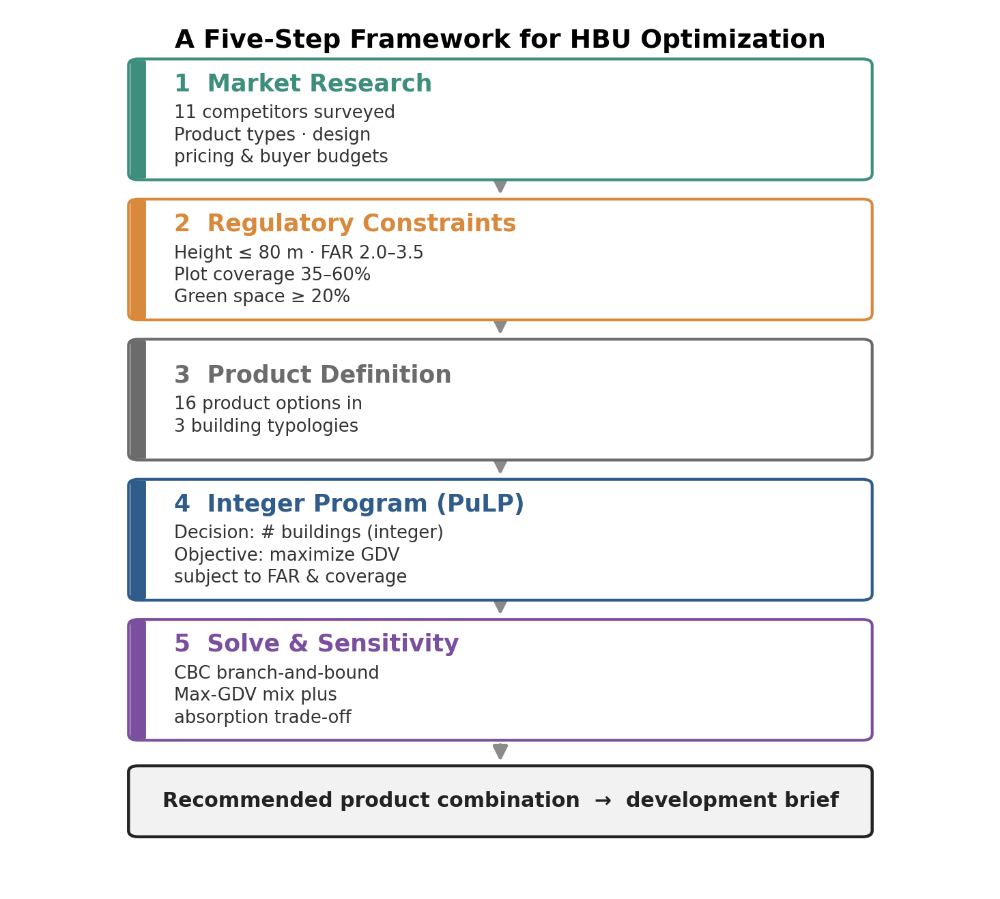
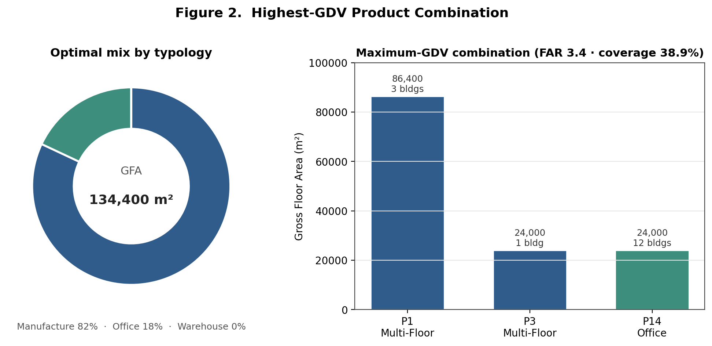
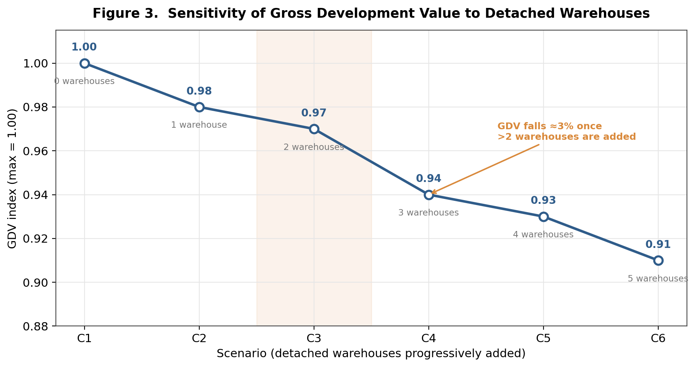
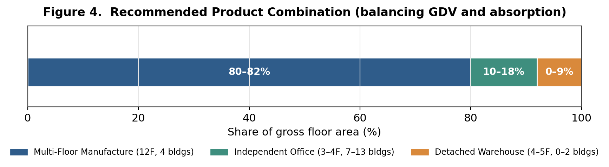

# Operationalizing Highest and Best Use: A GDV-Oriented Integer-Programming Approach to Product-Mix Optimization for Business-Park Development

Shuai Ma, Internal Research Project, Ping An Group, 2021
Field: Urban Planning, Land-Use Economics, and Computational Decision Support
Empirical setting: an industrial and R&D land parcel in Nanhai District, Foshan, China

## Abstract

Highest and Best Use (HBU) is a foundational idea in land economics and real-estate appraisal, yet in practice it is usually resolved through expert judgment rather than explicit computation. This brief reframes a product-mix decision for a Chinese business park as a constrained optimization problem structured by the logic of the four classical HBU tests. Legal permissibility and physical possibility enter as constraints, while the maximally productive use is approximated by maximizing Gross Development Value (GDV); a complete financial-feasibility test that nets out construction cost, financing, phasing, and discounting lies beyond this single-objective formulation and is flagged as future work. Solved as an integer linear program (ILP) over sixteen predefined building products and the binding zoning parameters of the site, the model maximizes GDV subject to floor area ratio (FAR) and plot-coverage limits. The optimum favors multi-floor manufacturing buildings combined with independent offices and excludes detached warehouses entirely. A sensitivity analysis then quantifies the GDV penalty of reintroducing warehouses for liquidity reasons, surfacing the trade-off between value maximization and market absorption that pure optimization tends to obscure. The study illustrates how operations research can make early-stage product-positioning analysis more transparent, reproducible, and fast.

## 1. Introduction and Research Problem

Product design is one of the earliest and most consequential decisions in property development. During the concept and feasibility stage, a developer must decide what to build before committing capital: whether a business park should contain multi-story manufacturing facilities, individual office units, detached warehouses, or some mixture, and in what proportions. A misalignment between the product program and underlying demand can depress sales and leasing performance and, in the worst case, compromise the viability of the entire scheme. Because these choices are made under uncertainty and are difficult to reverse once construction begins, they carry disproportionate risk relative to the effort usually devoted to them.

Conventional practice resolves the product-mix question through market positioning workshops, comparable-project benchmarking, and the professional intuition of appraisers and development managers. These methods are valuable but they are also opaque, hard to reproduce, and slow to explore the combinatorially large space of feasible building programs. The research question motivating this brief is therefore methodological: **can the determination of a business park's Highest and Best Use be formalized as a transparent optimization problem whose assumptions are explicit and whose solution can be recomputed in seconds as inputs change?**

The study answers this question by translating a real product-positioning problem into an integer linear program. It was initiated and led as an internal research effort at Ping An Group for a site in the Nanhai District of Foshan. The contribution is not a new optimization algorithm but a demonstration that a familiar planning and appraisal concept can be operationalized with standard, open-source computational tools, producing decision support that is faster, auditable, and easier to subject to scenario analysis than judgment alone.

## 2. Conceptual Framework: HBU and Land-Use Optimization

Highest and Best Use is defined in appraisal theory as the reasonably probable use of land that is legally permissible, physically possible, financially feasible, and maximally productive, with the four tests applied in sequence so that only legally and physically admissible uses are evaluated for financial outcome (Ratcliff, 1949; Appraisal Institute, 2020). The concept is the practical counterpart of the bid-rent logic in urban land economics, in which competition allocates each parcel to the use able to extract the greatest residual value from it (Alonso, 1964; Brueckner, 2011). HBU thus already contains the structure of a constrained optimization problem: maximize productivity over the set of admissible uses.

The planning literature has long recognized this affinity. Linear and integer programming were applied to residential land allocation as early as the Penn-Jersey work of Herbert and Stevens (1960), and mathematical programming has since become a standard instrument for facility location, land-use allocation, and capital budgeting. What distinguishes the present application is its granularity. Rather than allocating land among broad use categories, the model selects integer quantities of specific, design-ready building products, so that the output is directly legible to architects and feasibility analysts. In this framing, the legal-permissibility and physical-possibility tests become the model's constraints, while the maximally productive use is approximated by a Gross Development Value objective. This is a deliberate simplification: GDV captures the revenue side of the financial-feasibility test but not construction cost, financing, phasing, or discounting, so the model operationalizes the structure of HBU rather than delivering a complete financial-feasibility appraisal. The discrete nature of buildings makes integer programming, rather than continuous linear programming, the appropriate formal tool (Dantzig, 1963; Land and Doig, 1960).

## 3. Study Context and Data

The subject parcel, located in Nanhai District, Foshan, is zoned for small-scale manufacturing and research-and-development office use and spans roughly 39,000 square meters. An on-site survey of eleven competing industrial campuses and business parks in the surrounding submarket was conducted to characterize demand along three dimensions: the product types on offer and their relative popularity; their architectural attributes, including floor count, unit areas, ceiling heights, column spacing, and supporting facilities; and per-unit pricing relative to typical buyer budgets.

The survey produced several findings that directly shaped the model inputs. Independent office buildings and detached manufacturing warehouses were the most sought-after typologies, while budget-constrained buyers treated multi-story manufacturing space as a viable substitute. Most buyer budgets fell within approximately ten million RMB, or about 1.4 million USD. Preferred unit sizes clustered between 1,000 and 1,200 square meters for multi-story manufacturing space, 600 to 1,000 square meters for detached warehouses, and around 300 square meters for independent offices. These observations were used to predefine sixteen candidate building products grouped into three typologies: six multi-floor manufacturing products, seven detached warehouses, and three independent offices. Table 1 reproduces a representative portion of the product catalogue.

**Table 1. Representative product options (after Table DS1-1).**

| Product | Building type | Floors | Unit / base area (m²) | Price, 1st floor (RMB/m²) | Price, upper floors (RMB/m²) | Price, whole building (RMB/m²) |
|---|---|---|---|---|---|---|
| P1 | Multi-Floor Manufacture | 12 | 1,200 | 11,000 | 5,500 | — |
| P2 | Multi-Floor Manufacture | 10 | 1,200 | 11,000 | 5,500 | — |
| P3 | Multi-Floor Manufacture | 12 | 1,000 | 11,000 | 5,500 | — |
| P7 | Detached Warehouse | 12 | 1,200 | — | — | 6,700 |
| P8 | Detached Warehouse | 10 | 1,200 | — | — | 6,700 |
| P9 | Detached Warehouse | 12 | 1,000 | — | — | 7,000 |
| P14 | Independent Office | 4 | 250 | — | — | 11,000 |
| P15 | Independent Office | 3 | 300 | — | — | 11,000 |
| P16 | Independent Office | 3 | 250 | — | — | 11,000 |

Pricing reflects an important market regularity. Multi-floor manufacturing space commands a high ground-floor price of about 11,000 RMB per square meter but a much lower upper-floor price of about 5,500 RMB, whereas independent offices sustain a uniform premium near 11,000 RMB across floors, and detached warehouses sell at a comparatively modest whole-building rate near 6,700 to 7,000 RMB. These differences in the price structure across typologies are what ultimately drive the optimal allocation.

## 4. Methodology: Formulating the Product-Mix Problem as an Integer Program

The development program is represented as a vector of decision variables, one per product, each giving the integer number of buildings of that type to construct. Every product carries a fixed attribute set, including base area, gross floor area, ceiling height, building type, per-unit price, and floor count, so that selecting a quantity of a product automatically determines its contribution to value and to each regulatory ratio. Figure 1 summarizes the five-step framework, from market research through regulatory screening and product definition to optimization and recommendation.

*Figure 1. The five-step framework that situates the optimization model within the broader feasibility workflow.*

Let $x_i \in \mathbb{Z}_{\ge 0}$ denote the number of buildings of product $i$, for $i = 1, \dots, 16$. Each product has unit area $a_i$, base (footprint) area $b_i$, floor count $f_i$, first-floor unit price $p^{\,1}_i$, and upper-floor unit price $p^{\,u}_i$. Let $L$ be the total land area of the parcel. The model maximizes Gross Development Value, computed as the saleable value of every building selected:

$$\max_{x}\; \text{GDV} = \sum_{i=1}^{16} \Big[\, p^{\,1}_i\, a_i + (f_i - 1)\, p^{\,u}_i\, a_i \,\Big]\, \cdot 2 \cdot x_i$$

The bracketed term values one stacked unit, charging the premium ground-floor rate to the first floor and the lower rate to the remaining floors; the factor of two reflects the paired (double-unit) configuration in which these buildings are marketed. GDV here is gross saleable value, not residual land value or developer profit, so the objective proxies the maximally productive use on the revenue side only; establishing full financial feasibility would additionally require construction cost, financing, phasing, and discounting, which this formulation deliberately leaves to future extension. Two families of constraints encode the binding zoning parameters of the site:

$$0.35 \;\le\; \frac{1}{L}\sum_{i} b_i\, x_i \;\le\; 0.60 \qquad \text{(plot coverage)}$$

$$2.0 \;\le\; \frac{1}{L}\sum_{i} b_i\, f_i\, x_i \;\le\; 3.5 \qquad \text{(floor area ratio)}$$

The remaining legal requirements are handled outside the two linear constraints. The 80-meter height ceiling is satisfied by construction, because no candidate product exceeds the limit, so this aspect of legal permissibility is met during product definition rather than during solving. The minimum 20 percent green-space requirement, by contrast, is not formally enforced by the model. A plot-coverage cap of 60 percent guarantees only that at least 40 percent of the site is unbuilt; it does not by itself guarantee 20 percent green space, because roads and surface parking also draw on the non-built area. In the reported solutions the realized coverage is far below the cap, near 39 percent, leaving roughly 61 percent unbuilt, and the green-space minimum was checked after the fact against the site plan rather than embedded as a constraint. Encoding it explicitly, as a linear constraint on open area net of roads and parking, is a straightforward refinement and is noted among the limitations below. This separation of constraints into pre-filtering and in-model components keeps the program small and linear, at the cost of leaving the green-space test outside the optimizer.

The formulation is a pure integer linear program and is solved with PuLP, an open-source Python modeling library that passes the problem to the COIN-OR CBC branch-and-bound solver (Mitchell, O'Sullivan and Dunning, 2011; Land and Doig, 1960). The practical advantage over a spreadsheet solver is substantial. Whereas a general-purpose spreadsheet optimizer can take an impractically long time to search this combinatorial space, the ILP returns a certified optimal program in seconds, which makes it feasible to rerun the model across many regulatory and market scenarios rather than evaluating a handful of hand-built options.

## 5. Results

Solving the model yields a clear and economically intuitive optimum. The maximum-GDV program, shown in Table 2 and Figure 2, combines multi-floor manufacturing buildings with independent offices and contains no detached warehouses. Three P1 buildings and one P3 building supply roughly 82 percent of gross floor area, with the balance provided by twelve compact P14 office buildings. The program reaches a FAR of 3.4 and a plot coverage of 38.9 percent, sitting just inside the regulatory envelope.

**Table 2. Maximum-GDV combination (after Table DS1-2). GFA 134,400 m²; FAR 3.4; plot coverage 38.9%.**

| Product | Type | Unit area (m²) | Floors | Buildings | GFA (m²) | Share of GFA | Relative GDV |
|---|---|---|---|---|---|---|---|
| P1 | Multi-Floor Manufacture | 1,200 | 12 | 3 | 86,400 | 64% | 0.56 |
| P3 | Multi-Floor Manufacture | 1,000 | 12 | 1 | 24,000 | 18% | 0.16 |
| P14 | Independent Office | 250 | 4 | 12 | 24,000 | 18% | 0.29 |

Each row's gross floor area follows the paired-unit convention, unit area times two times floors times buildings, so P1 contributes 1,200 by 2 by 12 by 3 equals 86,400, P3 contributes 1,000 by 2 by 12 by 1 equals 24,000, and P14 contributes 250 by 2 by 4 by 12 equals 24,000. The three rows sum exactly to 134,400 square meters, and the relative-GDV column likewise sums to one, so the reported program is fully reproducible from the inputs.

*Figure 2. Composition of the highest-GDV combination by typology and by product.*

That detached warehouses are absent from the value-maximizing solution corroborates the market survey, which found warehouses to carry thin profit margins. An independent reconstruction of the program for this brief reproduced the same qualitative result: the optimizer again selected only multi-floor manufacturing and office products, drove both the FAR and the plot-coverage constraints to their upper bounds, and excluded warehouses, confirming that the reported solution follows from the model logic rather than from incidental input choices.

The survey, however, also noted that warehouses, precisely because they are scarce, enjoy a high absorption rate and are easy to sell. Because cash-flow timing matters as much as headline value, the study deliberately reintroduces warehouses and measures the cost. Table 3 and Figure 3 report a sensitivity analysis in which detached warehouses are progressively added to the program. The GDV index declines monotonically from 1.00 to 0.91 across six scenarios, and the marginal penalty steepens once more than two warehouses are included, where the index drops by about three percent in a single step.

**Table 3. Sensitivity of the GDV index to added detached warehouses (after Table DS1-4).**

| Scenario | Detached warehouses added | GDV index | Change |
|---|---|---|---|
| C1 | 0 | 1.00 | — |
| C2 | 1 | 0.98 | −2% |
| C3 | 2 | 0.97 | −1% |
| C4 | 3 | 0.94 | −3% |
| C5 | 4 | 0.93 | −1% |
| C6 | 5 | 0.91 | −2% |

*Figure 3. Each added warehouse lowers GDV; the penalty accelerates beyond two warehouses.*

Reading the value surface together with the absorption evidence yields the final recommendation in Table 4 and Figure 4. The program retains multi-floor manufacturing as the dominant typology at 80 to 82 percent of floor area, includes independent offices at 10 to 18 percent for their pricing premium and steady demand, and admits a small warehouse component of up to roughly 9 percent to support early sales velocity without materially eroding value. The recommendation is expressed as ranges rather than point values, acknowledging that the final program should remain responsive to design refinement and updated market signals.

**Table 4. Recommended product combination (after Table DS1-5).**

| Building type | Single unit (m²) | Double unit (m²) | Floors | Buildings | Share of GFA |
|---|---|---|---|---|---|
| Multi-Floor Manufacture | 1,000–1,200 | 2,000–2,400 | 12 | 4 | 80–82% |
| Independent Office | 250–300 | 500–600 | 3–4 | 7–13 | 10–18% |
| Detached Warehouse | 600–800 | 1,200–1,600 | 4–5 | 0–2 | 0–9% |

*Figure 4. The recommended program balances value maximization against market absorption.*

## 6. Discussion: Planning Implications and Limitations

The exercise demonstrates three things of interest to planning scholarship and practice. First, it shows that the logic of HBU, often treated as a matter of seasoned judgment, can be stated precisely enough to compute. Legal permissibility and physical possibility map cleanly onto constraints, and the maximally productive use onto a Gross Development Value objective; the financial-feasibility test is only partially represented, since GDV captures revenue but not cost, financing, or discounting. Making these assumptions and their boundaries visible is itself a contribution, because it exposes them to scrutiny, debate, and revision in a way that tacit expertise does not. Second, the regulatory parameters that planners set, the FAR band, the coverage limits, the height ceiling, and the green-space minimum, are not background conditions but the active constraints that shape the optimum; in this case the FAR and coverage limits bind, which means that a marginal change in either would move the recommended program. The model therefore doubles as a tool for examining how zoning choices translate into built outcomes. Third, the value-versus-absorption tension shows the limits of single-objective optimization: a program that maximizes GDV alone may be unattractive once liquidity and cash-flow risk are considered, which is precisely why the recommendation departs from the unconstrained optimum.

Several limitations qualify these results and point toward extensions. The objective treats prices as fixed exogenous inputs, ignoring the price elasticity that would accompany flooding the submarket with a single product; the independent reconstruction made this vivid by concentrating floor area in the highest-margin office product more aggressively than any real market could absorb, which is exactly the behavior the absorption analysis is designed to temper. Absorption is handled as a secondary screen rather than as a formal second objective, so a natural next step is a bi-objective or chance-constrained formulation that trades expected value against absorption risk explicitly. Relatedly, the objective is Gross Development Value, a gross-revenue measure, rather than residual land value or risk-adjusted profit; a stricter financial-feasibility test would net out construction cost, financing, and discounting over the development period, which can change the ranking among products with different cost structures. The model is also static, optimizing a single end-state rather than a phasing sequence. Finally, the 20 percent green-space requirement is verified after the fact rather than imposed as a constraint, and folding it, together with road and parking area, into the feasible region would make the regulatory envelope fully explicit. None of these caveats undermines the central methodological claim; they instead sketch a research agenda in which computational feasibility analysis is progressively enriched toward the full complexity of development decision-making.

## 7. Conclusion

This brief has reframed a concrete business-park product-mix decision as an integer linear program that operationalizes the logic of Highest and Best Use, using Gross Development Value as a transparent, if partial, proxy for the maximally productive use that underlies both land-use planning and real-estate appraisal. The model recovers an economically sensible optimum, quantifies the value cost of pursuing liquidity, and produces an auditable recommendation in seconds using open-source tools. More broadly, it illustrates a transferable template for computational decision support in planning, in which regulatory parameters enter as constraints, value enters as an objective, and scenario analysis replaces one-off judgment. Extending the approach to endogenous pricing, multi-objective absorption, and phased build-out is a promising direction for further research at the intersection of urban planning, land economics, and operations research.

## References

Alonso, W. (1964). *Location and Land Use: Toward a General Theory of Land Rent.* Harvard University Press.

Appraisal Institute. (2020). *The Appraisal of Real Estate* (15th ed.). Appraisal Institute.

Brueckner, J. K. (2011). *Lectures on Urban Economics.* MIT Press.

Dantzig, G. B. (1963). *Linear Programming and Extensions.* Princeton University Press.

Herbert, J. D., and Stevens, B. H. (1960). A model for the distribution of residential activity in urban areas. *Journal of Regional Science,* 2(2), 21–36.

Land, A. H., and Doig, A. G. (1960). An automatic method of solving discrete programming problems. *Econometrica,* 28(3), 497–520.

Mitchell, S., O'Sullivan, M., and Dunning, I. (2011). *PuLP: A Linear Programming Toolkit for Python.* University of Auckland.

Ratcliff, R. U. (1949). *Urban Land Economics.* McGraw-Hill.

Wheaton, W. C., and DiPasquale, D. (1996). *Urban Economics and Real Estate Markets.* Prentice Hall.
