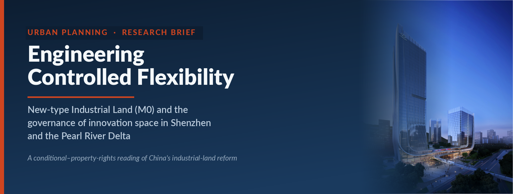
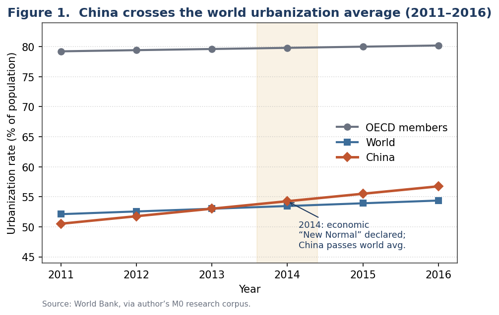
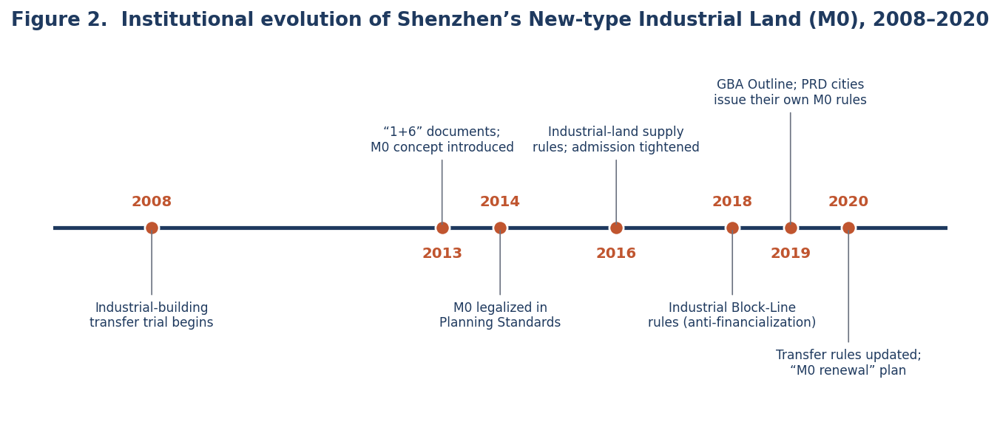
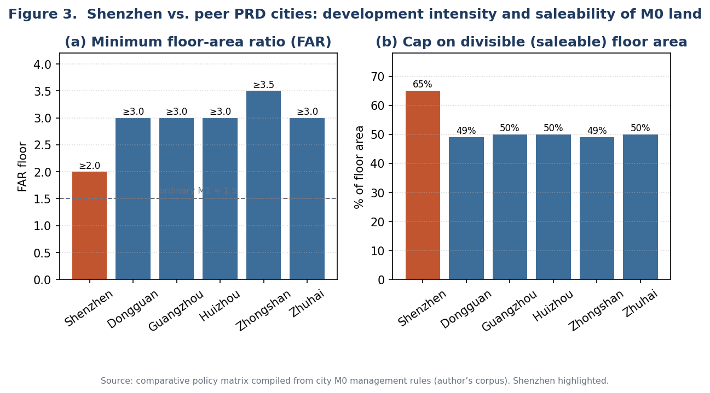
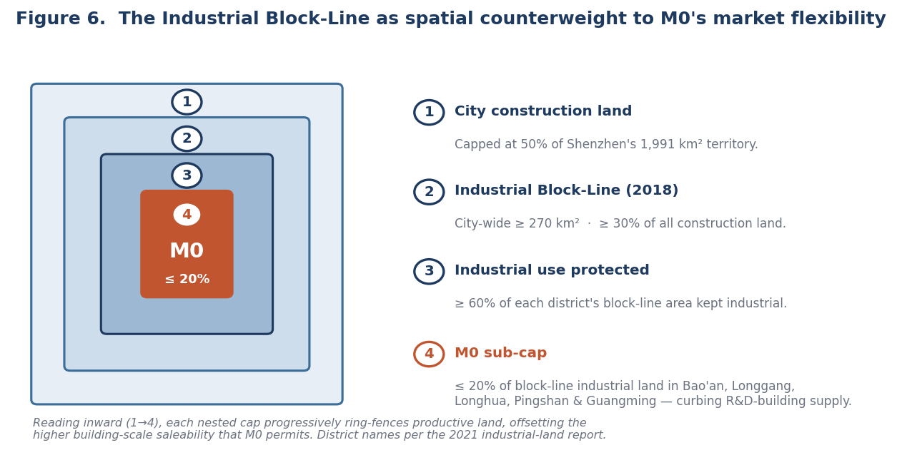

```{=html}
<div class="cp-header">
  <div class="cp-tag">Research Brief · Urban Planning &amp; Land Policy · Internal Research Report · Ping An Group · 2021</div>
  <h1 class="cp-title">Engineering Controlled Flexibility</h1>
  <div class="cp-meta">
    <strong>New-type Industrial Land (M0) and the Governance of Innovation Space in Shenzhen and the Pearl River Delta</strong><br>
    <span class="cp-author">Shuai Ma</span>
  </div>
</div>
```

{width=82%}

## Abstract

As China's leading megacities exhaust their developable land, planners confront a sharpening dilemma: how to supply affordable space for the innovation economy on scarce industrial land without that land being arbitraged into disguised offices and apartments. This brief examines **New-type Industrial Land** (新型产业用地, "M0"), a hybrid land-use category pioneered in Shenzhen after 2013 and since diffused across the Pearl River Delta (PRD). Reading municipal policy texts from seven cities against a 2021 market scan and project case material, I argue that M0 is best understood not as a zoning label but as an instrument of *controlled flexibility* operationalized through **conditional property rights**: it grants higher intensity and a mixed industrial-plus-service program only in exchange for admission gatekeeping, transfer caps, shortened tenure, value recapture, and post-occupancy performance review. The Shenzhen case reveals both the model's promise and its defining tension—a delivered pipeline that drifts toward the most saleable product the rules permit, policed by a regime that must keep closing the loopholes its own flexibility creates.

## 1. Research problem and question

For three decades, urban growth in China was synonymous with the outward conversion of farmland to factories and housing. By the mid-2010s that model had reached its limit. In May 2014, central leadership reframed the economy as having entered a "New Normal" (新常态) of slower, quality-oriented growth—the same year China's urbanization rate crossed 54.8 percent and overtook the world average (Figure 1). The planning task shifted from *extensive* expansion to *intensive* redevelopment, and from accommodating manufacturing to housing a knowledge economy with very different spatial needs: laboratories, pilot-production lines, design studios, and the amenities that retain skilled labor.

This transition exposed a structural contradiction. Conventional industrial land (designated **M1**) is priced low and tightly use-restricted to protect manufacturing, yet cannot legally or economically host the hybrid research-and-production functions of the innovation economy. Where the rules were relaxed informally, developers predictably converted cheap industrial plots into high-margin offices and quasi-apartments—a "real-estatization" (房地产化) of industrial land that hollowed out the productive base the land was meant to defend. The source corpus is blunt about the result: early Shenzhen industrial redevelopment often produced office-like buildings, yielding a paradox of "too little factory space, vacant office space" and pushing manufacturers out of the city. M0 emerged as the planning system's attempt to resolve this contradiction *by design*.

This brief therefore asks a single question with three facets: **How does the M0 category attempt to reconcile land-use intensification, industrial upgrading, and protection against real-estate financialization—and how does the resulting regime perform in practice?**

{width=88%}

---

## 2. Why Shenzhen: a critical case

Shenzhen is the analytically appropriate **critical case** because it faces China's most acute land constraints and has long served as the country's land-policy laboratory. By the late 2010s, built-up land already covered roughly 46 percent of the city's 1,991 km² territory, pressing against a binding 50 percent ceiling on construction land; projected new greenfield supply had fallen below 60 km². Compounding the squeeze, industrial and warehousing uses occupied more than 30 percent of the existing land stock—far above the share in mature global cities, where industrial land sits under 10 percent. Redeveloping low-efficiency industrial land was thus a structural necessity, reinforced by the city's 2020 renewal plan, which capped new "industrial-to-M0" conversion at 133.5 hectares within a 679-hectare demolition-and-reconstruction program and assigned two-thirds of its 15 km² of land-preparation tasks to industrial space.

Shenzhen also possessed the institutional appetite to experiment (Figure 2). It began permitting the divisible transfer of industrial buildings as early as 2008; introduced the M0 concept in its 2013 "1+6" reform package; and in 2014 wrote M0 into its statutory *Urban Planning Standards and Guidelines*, giving the category legal standing. A subsequent decade of refinement—culminating in the 2018 Industrial Block-Line regulation and the 2020 transfer rules—progressively recalibrated the balance between encouraging development and curbing speculation, supplying both a template and cautionary lessons for neighboring cities.

{width=88%}

---

## 3. Conceptual framework and methodology

I read M0 as *flexible (hybrid) zoning* deployed as a tool of *anti-financialization*, and I argue that its defining mechanism is **conditional property rights**. The category decouples two things that conventional industrial zoning bundled together: the physical and functional *generosity* developers need to build innovation space, and the *tradability* that turns such space into a speculative asset. M0 expands the former while constraining the latter (Figure 3). The right to build more intensively is granted only in exchange for limits on who may occupy or buy, how much may be subdivided and sold, how long the rights last, and whether performance targets are met. The outcome is a regime of **controlled flexibility**—a deliberate engineering of permissiveness and discipline within a single land class, characteristic of an entrepreneurial-yet-interventionist local state.

Methodologically, the brief uses **comparative policy (content) analysis** of primary planning and land-management documents, structured as a most-similar comparison across seven PRD cities—Shenzhen, Dongguan, Guangzhou, Foshan, Huizhou, Zhongshan, and Zhuhai—that adopted M0 or equivalent categories between 2018 and 2020. For each city, provisions were coded into a common matrix across six dimensions: industry admission, development intensity, functional mix, transferability and tenure, value capture, and performance monitoring. Shenzhen is treated as the benchmark case. The reconstruction is then triangulated against secondary market evidence—a first-half-2021 inventory scan and project-level case histories—to test how the formal rules play out on the ground. The approach is interpretive rather than causal: it surfaces the regime's internal logic and its tensions. Market figures are read cautiously, as they derive from internal and brokerage research within a single region.

{width=88%}

---

## 4. The regulatory architecture

Shenzhen defines M0 as land "fusing research and development, creativity, design, pilot-testing, pollution-free production, and related supporting services." Two features mark it as industrial policy rather than real-estate policy. First, it is priced at the *mean* of the industrial and office benchmark land prices, not the low industrial benchmark—raising the entry cost enough to dampen pure arbitrage. Second, it preserves an industrial core: factory and R&D space must together hold at least 70 percent of gross floor area, with supporting uses capped at 30 percent. Table 1 sets the category against ordinary M1 land.

**Table 1. New-type (M0) versus ordinary (M1) industrial land in Shenzhen**

| Dimension | M1 — Ordinary industrial | M0 — New-type industrial | Planning meaning |
|---|---|---|---|
| Dominant use | Manufacturing (factory) | Clean production **and** R&D (≥70% of GFA) | Broadens what counts as "industrial" |
| Land-price basis | Industrial benchmark | Mean of industrial **and** office benchmarks | Higher entry cost dampens arbitrage |
| Base FAR (by density zone) | 1.5–3.5 | 2.0–4.0 (ceiling 6.0) | Treated as a more intensive category |
| Minimum divisible unit | ≈1,000 m² (factory) | ≈300 m² (R&D space) | Far easier to subdivide and sell |
| Supporting uses | Limited | ≤30% of GFA (commercial, dorms, utilities) | More service support, but ring-fenced |

On the *flexibility* side, M0 is markedly more generous than M1: floor-area ratios start well above ordinary industrial land—Shenzhen mandates a floor of 2.0 and permits up to 6.0 in high-density zones—signaling the "industry-goes-vertical" (工业上楼) agenda, while a 30 percent functional-mix allowance brings in the dormitories, canteens and services that innovation districts require.

On the *control* side, M0 throttles the conversion of space into a tradable asset, and it is here that cities diverge in calibration (Figure 4, Table 2). The single most consequential lever is the cap on divisible (saleable) floor area. Shenzhen permits up to 65 percent of an industrial building to be subdivided and sold, with all on-plot supporting facilities transferable; its peers are stricter, capping divisible sale at 49–50 percent and obliging developers to *self-hold* the balance for long periods—Zhongshan, for instance, requires at least 51 percent to be held for fifteen years. Land is supplied mainly by public auction, with tenure shortened relative to conventional industrial land (Shenzhen ≤30 years against 40–50 elsewhere) and "rent-then-grant" arrangements encouraged. A graduated **value-added recapture** removes the speculative incentive on early resale: in Shenzhen a transfer within five years can surrender up to 100 percent of the gain. Entry is screened twice over—by developer qualification and by occupier industry—through a "district nominates, city verifies, district approves" sequence, and binding supervisory agreements impose performance review at completion and every five years thereafter. Tellingly, Shenzhen sets *no* citywide economic threshold, devolving investment-intensity, output-per-*mu* and tax targets to each district under a "one district, one policy" (一区一策) principle, whereas Dongguan and Zhuhai hard-code floors of ¥6 million per *mu* in investment and ¥12 million in output.

{width=88%}

**Table 2. Comparative M0 regulatory matrix, selected PRD cities**

| City | FAR | Support cap | Divisible-sale cap | Min. unit | Max. tenure |
|---|---|---|---|---|---|
| **Shenzhen** | ≥2.0 (–6.0) | ≤30% | ≤65% | 300 m² | ≤30 yr |
| Dongguan | 3.0–5.0 | ≤30% | ≤49% | 300 m² | ≤40–50 yr |
| Guangzhou | ≥3.0 | ≤30% | ≤50% | 500 m² | ≤50 yr |
| Huizhou | ≥3.0 | ≤50% | ≤50% | 300 m² | ≤50 yr |
| Zhongshan | 3.5–6.0 | ≤30% | ≤49% (≥51% self-held, 15 yr) | 500 m² | ≤50 yr |
| Zhuhai | 3.0–5.0 | ≤30% | ≤50% | 300 m² | ≤40 yr |

A revealing pattern emerges from Table 2: Shenzhen sets the **lowest FAR floor** yet the **highest saleable-area cap** of the group. This is not laxity. It reflects Shenzhen's reliance on two parallel instruments—the Industrial Block-Line and district-level performance contracts—to do the disciplining that other cities hard-code into uniform intensity and transfer limits. Different cities, in short, distribute the same regulatory burden across different tools.

---

## 5. From rules to reality: market outcomes

The market evidence confirms that the tension the framework is built to manage never fully disappears. A first-half-2021 scan identified roughly twenty industrial projects for sale in Shenzhen—the overwhelming majority of them M0—with for-sale space dominated by **research-and-development buildings**: more than 1,800 R&D units were on the market, while only two projects offered any factory stock at all. A flexible category had created supply, but the supply concentrated in the most office-like, most saleable product the rules allow.

The drivers are structural. R&D space is far easier to package, finance, lease and sell than factory floor: minimum divisible units run about 300 m² for R&D against 1,000 m² for factories, design standards are lighter (lower floor loads, fewer freight elevators), and the floor-area-ratio premium—often more than 1.0 once project coefficients are applied—maximizes saleable value (Figure 5). Where the rules still bound, developers innovated around them. Case histories document shell-company registration to qualify otherwise-ineligible buyers, negotiated bank financing to widen the purchaser pool (one M1 project arranged 50 percent mortgages through cooperating banks), and "lease-as-sale" structures in which a fifteen-year lease priced at the full sale value monetizes space that cannot legally be sold.

{width=88%}

A clear **regulatory generational divide** is visible across projects. Fangda City, entering the market in 2015, could sell to any registered company with minimal industry scrutiny—buyers could even commission a third party to register a qualifying shell firm. Newer projects such as Langjun Plaza (2021) require a locally registered firm with at least three years of operating history conforming to the district's industrial plan, and block-line buyers must show a three-year tax record. Each policy generation reads as the planning system closing loopholes revealed by the last. By the second half of 2021, moreover, absorption of M0 dormitory product had slowed sharply as investment buyers retreated and mortgage review tightened—evidence that the demand for these "industrial" products had been substantially investment-driven all along.

---

## 6. The block-line counterweight

Shenzhen's unusual tolerance for building-scale saleability is offset at the *spatial* scale by the Industrial Block-Line, the structural anchor of the whole regime (Figure 6). The 2018 measures fix a citywide block-line of no less than 270 km² (at least 30 percent of construction land), require industrial use to remain at least 60 percent of each district's block-line area, and—decisively—cap M0 at no more than 20 percent of block-line industrial land in five key manufacturing districts (Bao'an, Longgang, Longhua, Pingshan and Guangming), explicitly to restrain R&D-building supply and steer the market back toward genuine factory space. Market flexibility *within* M0 is thus contained by a hard spatial perimeter *around* industry as a whole. The two instruments are designed to be read together: the block-line protects industrial geography, while M0 governs the internal flexibility of what is built inside it.

{width=88%}

---

## 7. Policy implications and conclusion

The Shenzhen case suggests that mixed industrial land should be governed as an *adaptive production platform*, not as relaxed commercial zoning. Four design lessons follow. First, **make intensity conditional on verified occupancy**: floor-area ratios, subdivision rights and support-space allowances should be tied to tenant composition and renewed output commitments, not granted at entitlement and assumed permanent. Second, **regulate product form, not just land use**, because arbitrage operates through unit size, tenure and financing—the variables that actually separate a laboratory from a saleable office—rather than through the land label alone. Third, **make "one district, one policy" legible**: district-specific calibration fits Shenzhen's heterogeneous industrial geography, but its criteria must be published if devolution is not to collapse into discretion. Fourth, **review block-lines and M0 rules together**, since in isolation one can freeze obsolete formats while the other permits excessive office-like conversion.

New-type Industrial Land is a sophisticated response to a hard planning problem: innovation-oriented production no longer fits twentieth-century industrial zoning, yet industrial land is quickly absorbed by higher-return real-estate uses. M0 grants flexibility through conditions—industry admission, intensity rules, transfer caps, shortened tenure, resale controls and performance monitoring—and contains it spatially through the block-line. Its rapid diffusion across the PRD demonstrates transferability; its delivered pipeline, skewed toward saleable R&D product and policed through successive loophole-closing, demonstrates fragility. The model is therefore best evaluated not as a land label or a development product but as an *institutional mechanism for keeping productive capacity inside a land-constrained metropolis*. The principal limitation of this brief—reliance on formal policy texts and single-region secondary market data—points to the next step: pairing this regulatory reconstruction with firm-level occupancy and outcome data to test whether M0 ultimately protects, rather than merely relabels, productive urban space.
