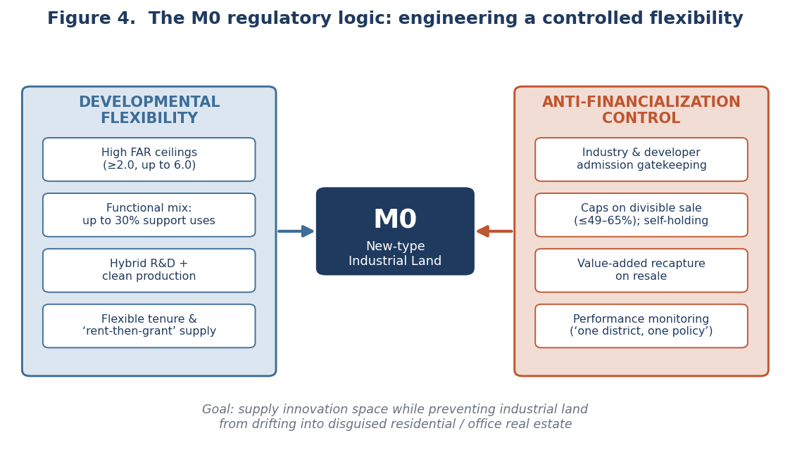

```{=html}
<div class="cp-header">
  <div class="cp-tag">Research Brief · Urban Planning &amp; Land Policy · 2021</div>
  <h1 class="cp-title">Engineering Controlled Flexibility</h1>
  <div class="cp-subtitle">New-type Industrial Land (M0) and the Governance of Innovation Space in Shenzhen</div>
  <div class="cp-meta">
    <span class="cp-author">Shuai Ma</span>
  </div>
</div>
```

## Abstract

As China's megacities exhaust developable land, planners face a sharp dilemma: how to supply affordable space for the innovation economy on scarce industrial land without that land being arbitraged into disguised offices and apartments. This study examines New-type Industrial Land (新型产业用地, "M0"), a hybrid category pioneered in Shenzhen after 2013 and diffused across the Pearl River Delta, and argues that M0 is best understood not as a zoning label but as an instrument of controlled flexibility operationalized through conditional property rights: it grants higher intensity and a mixed industrial-plus-service program only in exchange for admission gatekeeping, transfer caps, shortened tenure, value recapture, and performance review.

## What the study does

The analysis reads municipal policy texts from seven PRD cities, Shenzhen, Dongguan, Guangzhou, Foshan, Huizhou, Zhongshan, and Zhuhai, as a most-similar comparison, coding each city's provisions into a common matrix across six dimensions: industry admission, development intensity, functional mix, transferability and tenure, value capture, and performance monitoring. Shenzhen is treated as the critical case because it faces China's most acute land constraints and has long served as the country's land-policy laboratory. The regulatory reconstruction is then triangulated against a first-half-2021 market scan and project case histories to test how the formal rules play out on the ground.

## What it finds

M0 decouples two things that conventional industrial zoning bundled together: the generosity developers need to build innovation space, and the tradability that turns such space into a speculative asset. It expands the former, floor-area ratios from 2.0 up to 6.0 and a 30 percent service allowance, while constraining the latter through divisible-sale caps, self-holding requirements, shortened tenure, and graduated resale recapture that can claw back up to 100 percent of an early gain.



The defining tension never disappears. The 2021 market scan found the for-sale pipeline dominated by research-and-development buildings, more than 1,800 R&D units versus almost no factory stock, because R&D space is easier to subdivide, finance, and sell than factory floor. Where rules still bound, developers innovated around them through shell-company registration and lease-as-sale structures. Each policy generation reads as the planning system closing the loopholes its own flexibility created, and Shenzhen offsets its unusually high building-scale saleability with a hard spatial perimeter, the Industrial Block-Line, that caps M0 at 20 percent of block-line industrial land in key manufacturing districts.

## Why it matters

The case suggests that mixed industrial land should be governed as an adaptive production platform, not as relaxed commercial zoning. Intensity should be made conditional on verified occupancy rather than granted at entitlement; regulation should target product form, unit size, tenure, and financing, not just the land label, because that is where arbitrage operates; and block-line and M0 rules should be reviewed together, since in isolation one can freeze obsolete formats while the other permits office-like conversion. M0 is thus best evaluated not as a land label or a development product but as an institutional mechanism for keeping productive capacity inside a land-constrained metropolis. The reconstruction is interpretive rather than causal, and the market figures are read cautiously, since they derive from internal and brokerage research within a single region.

*This is a condensed brief. The full paper develops the regulatory architecture, the comparative matrix, and the market evidence in detail.*
