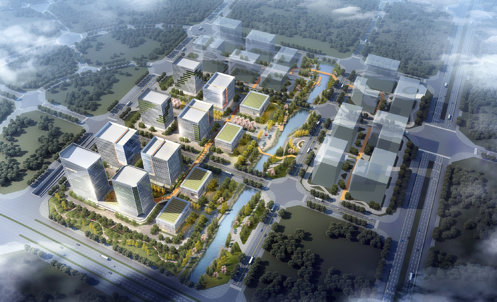
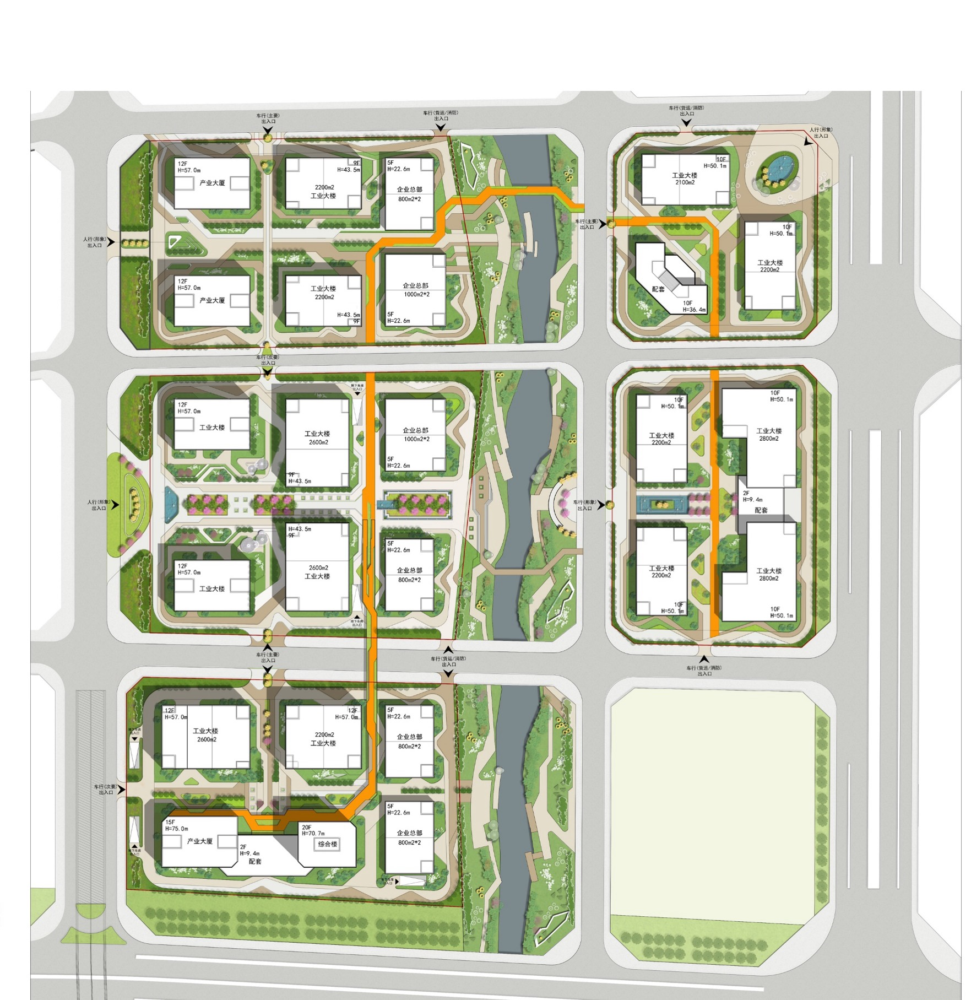
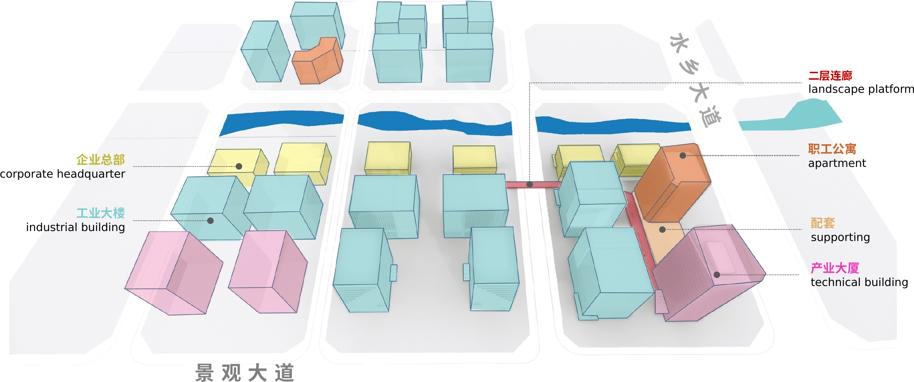
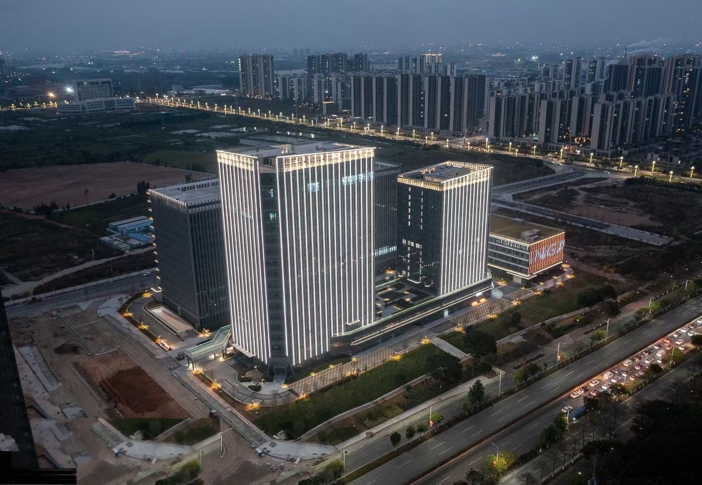

```{=html}
<div class="cp-header">
  <div class="cp-tag">Project Brief · Vertical Manufacturing Campus · Ping An · 2020</div>
  <h1 class="cp-title">Ping An · Dongguan Water-Town Innovation Park</h1>
  <div class="cp-subtitle">A Completed 5G and Electronics Innovation Campus in Dongguan's Water-Town Delta</div>
  <div class="cp-meta">
    <span class="cp-author">Shuai Ma</span> · Master Planner &amp; Project Director<br>
    Master Plan, 2020 · Complete and in operation · Machong, Dongguan, Guangdong Province, China<br>
    ~220 mu (≈147,000 m²) · ~595,000 m² GFA · FAR 3–4 · towers to ~80 m (22 storeys)
  </div>
</div>
```


*Figure 1. Aerial design rendering — a vertical, mixed-use innovation park threaded by a water-town canal and green roofs.*

## Regional and Site Context

China Ping An's Water-Town Innovation Park occupies a roughly 220-mu (147,000-square-meter) parcel in Machong, a riverine town in the northwest of Dongguan at the heart of the Guangdong–Hong Kong–Macao Greater Bay Area. The site sits within the Guangzhou–Shenzhen Science and Technology Innovation Corridor, immediately across the river from Guangzhou's Huangpu manufacturing district and first among the five towns of Dongguan's Water Town Economic Zone. Exceptional connectivity—an intercity-rail station about one kilometer away (fifteen minutes to Guangzhou South), two international airports, four intercity lines, metro, expressways, and deep-water ports—positions the park to absorb the industrial overspill of Guangzhou and Shenzhen. Commissioned by the financial group China Ping An, it was conceived not as a low-rise estate but as a vertical, mixed-use innovation district for the 5G and electronics-information industries. Across five parcels it assembles roughly 595,000 square meters of R&D towers, multi-storey industrial buildings, detached corporate headquarters, and staff apartments, with a green ratio near thirty percent and about 2,900 mostly underground parking spaces—an integrated "industry–city–people" community pitched at high-end researchers, technologists, and business talent.


*Figure 2. Site plan — five parcels on a pedestrian-priority block structure, organized around a continuous internal green loop and canal.*

## Planning Challenges and Constraints

The defining challenge was density. The brief called for roughly 595,000 square meters of floor area at a plot ratio of three to four and building coverage approaching forty percent—towers rising to some eighty meters—on a compact site embedded in a fragile water-town landscape of canals, ponds, and wetlands. Reconciling that intensity with a livable "garden office" environment, while satisfying a tiered skyline control (thirty meters at the water's edge rising to a one-hundred-meter gateway), was the central tension. Compounding it was the ambition to make "factory-on-floors" (gongye shang lou) genuinely workable—stacking real production, logistics, and research in mid- and high-rise buildings, an emerging typology in China—and to weave a complete 5G industrial chain into a still-maturing district.

## Distinctive Design Strategies

Three moves distinguish the result. First, vertical manufacturing: production halls, R&D towers, enterprise headquarters, staff apartments, and shared amenities are stacked and interlinked—industrial buildings with 8.1-meter ground floors and freight cores, towers of sixteen to twenty-two storeys—turning a 220-mu parcel into a 595,000-square-meter, FAR 3–4 campus and a Greater Bay Area model for high-density industrial urbanism. Second, blue-green integration: a canal threads the site, edged by waterfront greenways and thirty- and fifteen-meter buffers that connect to the nearby Huayang Lake National Wetland Park, complemented by rooftop gardens, vertical greening, and "city balconies" that lend a garden character to an intense program. Third, a mixed-use innovation community: research and production are joined by a conference-and-exhibition center, training, gym, cafés, canteens, and retail, linked by second-floor sky bridges and a pedestrian network separated from vehicles, forming a round-the-clock workplace. A deliberately staggered, "high-low and transparent" skyline presents the park as a gateway image along Shuixiang Avenue. Together these moves reframe the manufacturing park as an "elite city" workplace—dense and productive, yet green, walkable, and water-facing.


*Figure 3. Functional diagram — the stacked, interlinked program of R&D towers, industrial buildings, headquarters, apartments, and sky bridges.*

Now complete and in operation, the park realizes this vision—captured in the post-construction aerial below.


*Figure 4. The completed park in operation (aerial, dusk).*
