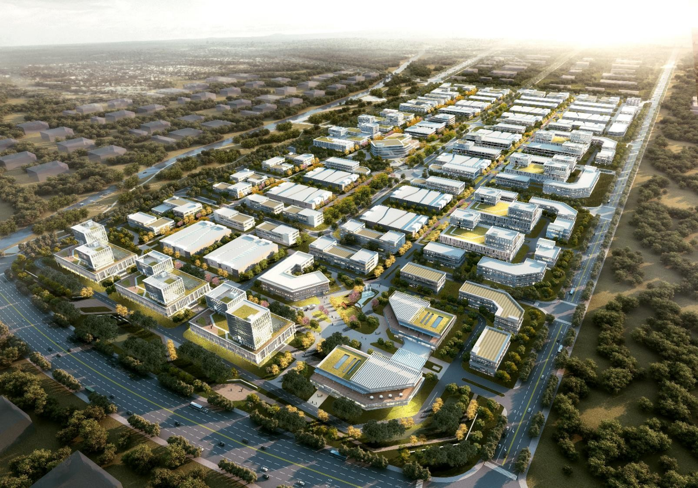
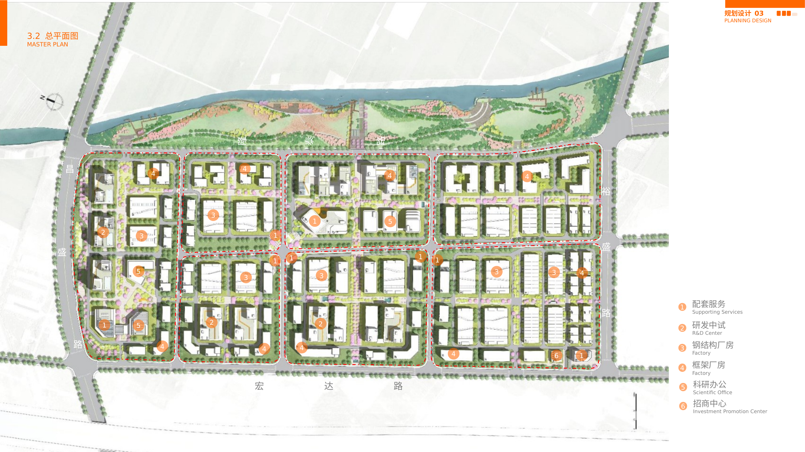
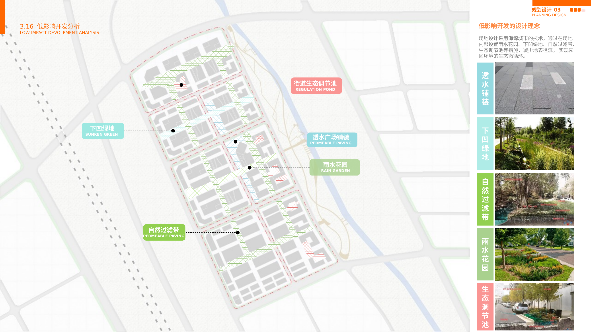
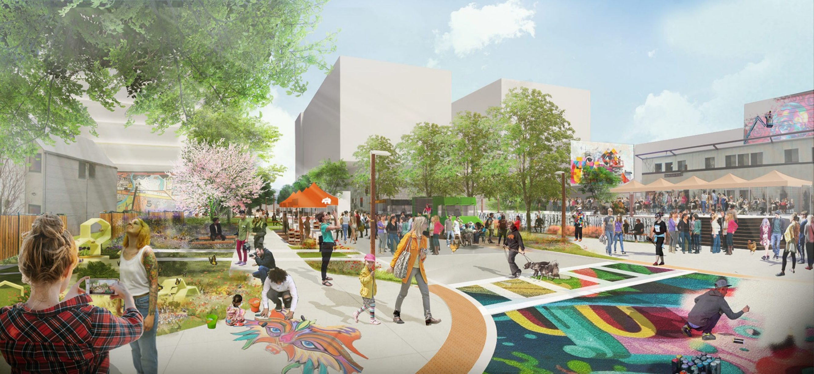

```{=html}
<div class="cp-header">
  <div class="cp-tag">Project Brief · Smart-Manufacturing District Planning · Ping An · 2021</div>
  <h1 class="cp-title">China Ping An · Zheng–Xu Smart-Manufacturing City</h1>
  <div class="cp-subtitle">A Full-Chain Manufacturing District for Xuchang's Industry-City Integration</div>
  <div class="cp-meta">
    <span class="cp-author">Shuai Ma</span> · Master Planner &amp; Sustainability Expert<br>
    Master Plan, 2021 · Design proposal / planning stage · Xuchang, Henan Province, China<br>
    ~1,150 mu (≈767,000 m²) · industrial, commercial, and green land · FAR 1.4–2.0 · 1–7 storeys
  </div>
</div>
```


*Figure 1. Aerial design rendering — a full-chain smart-manufacturing district framed by tree-lined streets and surrounding green space.*

## Regional and Site Context

China Ping An's Zheng–Xu Smart-Manufacturing City occupies the geographic center of Xuchang's Urban–Rural Integration Demonstration Zone, a roughly 60-square-kilometer growth area in central Henan Province. The site lies within an urban ecological corridor, ringed by municipal green space and edged on the east by the Xiaohong River; the Beijing–Hong Kong–Macao Expressway runs along its western flank, with an interchange about 1.7 kilometers away. Some 80 kilometers south of the provincial capital Zhengzhou and within an hour of Zhengzhou Xinzheng International Airport, the project is positioned as a node in the Central Plains Urban Agglomeration and the accelerating Zhengzhou–Xuchang ("Zheng–Xu") integration. Commissioned by the financial group China Ping An, the roughly 1,150-mu (767,000-square-meter) development was conceived as a full-chain smart-manufacturing park—spanning high-end equipment, new energy, new materials, automotive components, and cross-border logistics—rather than a conventional industrial estate. Its land budget—approximately 849 mu of industrial land, 209 mu of commercial frontage, and 92 mu of public green space on a "one-vertical, three-horizontal" road grid—was itself interrogated, with the team recommending that weakly supported commercial parcels be reallocated to productive use for a more compact, efficient campus.


*Figure 2. Master plan — production blocks on a clear road grid, framed by perimeter R&D/office frontage and an eastern riverfront green belt.*

## Planning Challenges and Constraints

The brief confronted a familiar dilemma of China's interior industrial districts. A high prescribed building density constrained spatial quality; the site sat well outside Xuchang's established urban core, with thin population, few daily amenities, and weak public-transit access unlikely to improve soon. Competitively, the surrounding region already hosted a mature equipment-manufacturing base, so product homogeneity and crowded investment markets threatened the park's ability to attract and retain tenants. The deeper challenge was structural: assembling a genuine industrial cluster—a complete, mutually reinforcing value chain rather than a mere accumulation of firms—while knitting an isolated manufacturing parcel into the surrounding ecological and civic fabric. The plan therefore had to deliver industrial efficiency and a livable, magnetic environment at once.

## Distinctive Design Strategies

Three commitments distinguish the scheme. First, ecological integration: an internal "landscape green ring" and a north–south green axis draw the bordering city parks and the Xiaohong River corridor into the site, producing a blue-green interwoven pattern that stitches the hard edge between factory and field. Second, water-sensitive, low-impact design: in keeping with Xuchang's sponge-city policy, rain gardens, sunken lawns, bioswales, ecological detention ponds, and permeable paving manage stormwater on site and sustain a self-regulating micro-hydrology. Third, a people-centered "industry–city–people" framework: a fifteen-minute walkable loop, a three-dimensional circulation system of sky bridges, rooftop gardens, and landscaped walks, and five customized building typologies—life-service center, R&D/pilot, frame and steel-structure workshops, and research offices—accommodate enterprises from 500 to 40,000 square meters. By co-locating raw-material processing, production, warehousing, logistics, and e-commerce on one campus, it also pursues a closed industrial loop and cross-sector synergy in place of isolated factories. Organized around three overlapping "loops" of ecology, daily life, and production, the plan reframes the industrial park as a green, intelligent, mixed-use district—a gateway advancing Zheng–Xu integration rather than an enclave.


*Figure 3. Low-impact development strategy — rain gardens, bioswales, detention ponds, and permeable paving implementing Xuchang's sponge-city policy.*

Developed to master-plan stage in 2021, the proposal remains a design vision; the rendering below conveys its intended human-scale character in lieu of post-construction photography.


*Figure 4. Eye-level rendering — a shared, pedestrian-priority public realm at the park's life-service core.*
